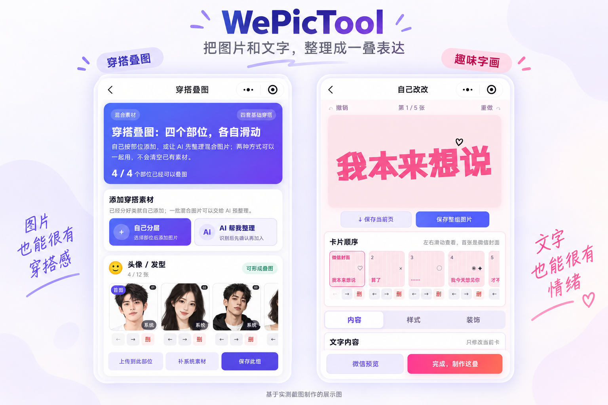
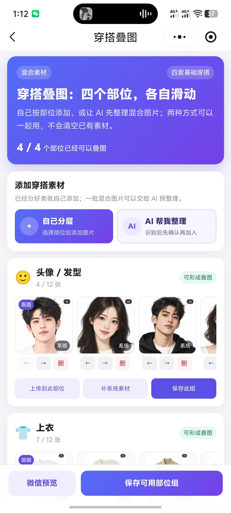
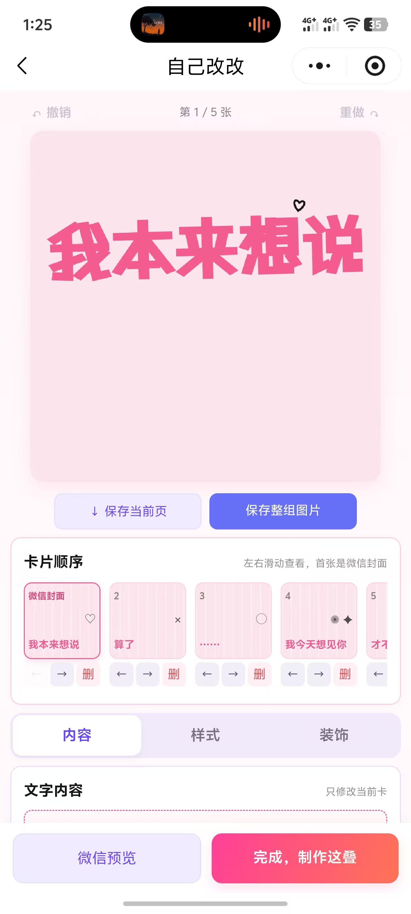

# WePicTool · 滑一叠

把图片和文字，整理成一叠表达。

WePicTool 是一个微信小程序，为聊天发送前的图片准备提供两种玩法：**穿搭叠图**和**趣味字画**。从素材整理、卡片编辑到聊天效果预览，再到审核后按顺序保存，让一组图片有封面、有顺序，也有自己的表达。



*上图基于用户提供的实测截图制作，为 AI 辅助展示合成图，不是新的真机测试记录。原始截图见下方。*

## 可以做什么

### 穿搭叠图

- **分组整理素材**：按头像 / 发型、上衣、下装、鞋子组织图片；未归入四类的 AI 结果放入「其他素材」。
- **手动与 AI 配合**：可以自己添加图片，也可以让 AI 分类并生成白底衣物图，再回到同一个工作台继续整理。
- **统一衣物构图**：通过衣物提取提示词和生成后的等比排版，让主体居中、减少多余留白；处理过程中显示完成数、失败数和单图状态。
- **明确控制顺序**：横向浏览素材，用前移、后移、删除按钮调整各组，按组预览和保存。

### 趣味字画

- **一句话变成一组卡片**：通过叙事规则、灵感案例和多套候选，把文字编排成可滑动的图组。
- **自由编辑**：修改文字、字号、字体、背景和配色，添加贴纸、涂鸦与手写笔迹，支持撤销、重做和本机草稿。
- **不局限于模板**：手写可作为贴纸加入当前卡，也可配纯色背景插入新卡；支持创建空白卡继续创作。
- **编辑与保存分开**：编辑、微信效果预览和进入结果页不提交最终保存审核；保存当前页、整组或结果图时，走对应的审核与导出流程。

### 预览、保存与发送

仿聊天预览支持明暗切换、展开与滑动查看。导出图片带有居中的浅灰底白色编号，保存过程显示逐张进度，失败时提供重试或续存提示。趣味字画预览页的「保存到相册」按编辑顺序保存整组，不因当前滑到哪一张而改变保存范围。

图片保存后提供「去微信发送」引导，**由用户自己选择聊天和相册图片**，不会自动选择好友或代为发送。

## 实测界面

以下是用户在开发测试过程中提供的原始截图，未经 AI 重绘。用于展示实际界面与交互布局；不代表所有设备、当前云端版本或微信正式发布状态均已验收。

<table>
  <tr><th>穿搭工作台</th><th>趣味字画编辑</th></tr>
  <tr>
    <td></td>
    <td></td>
  </tr>
</table>

## 技术组成

| 层级 | 实现 |
| --- | --- |
| 小程序客户端 | 原生 JavaScript、WXML、WXSS、Canvas 2D |
| 穿搭 AI | 云函数 `processOutfit`，千问分类与 CloudBase 混元图生图 |
| 字画渲染 | CloudBase 云托管 `fun-card-renderer`，服务端 Canvas 与镜像内字体 |
| 内容安全 | 微信内容安全接口、服务端身份校验与保存审核 |
| 本机数据 | 草稿、历史记录与导出状态的本地存储 |
| 工程检查 | Node 测试、语法检查、小程序预检、TypeScript 与文档校验 |

```text
WePicTool/
├── miniprogram/                 # 微信开发者工具导入目录
│   ├── pages/                   # 首页、工作台、编辑、预览、记录等页面
│   ├── utils/                   # 场景、手写、合成与顺序导出逻辑
│   ├── assets/                  # 字体、图标与内置素材
│   ├── cloudfunctions/          # AI 整理与内容安全云函数
│   └── cloudhosting/            # 趣味字画渲染服务
├── tests/                      # 自动化测试
├── scripts/                    # 预检与工程脚本
├── docs/                       # 产品、技术与部署文档
└── src/                        # 独立 Web 演示沙盒，非小程序上传代码
```

## 本地开发

准备 Node.js 20、npm 和微信开发者工具。

```bash
git clone https://github.com/Yiyang0659/WePicTool.git
cd WePicTool
npm ci
```

1. 在微信开发者工具中导入 **`miniprogram/`**，使用自己的小程序 AppID。
2. 根据 `miniprogram/config/env.js` 配置自己的 CloudBase 环境与服务名称。克隆代码不会自动获得原项目的云端服务和权限。
3. 需要真实 AI 与保存链路时，按[混元接入说明](docs/ai-workflows/hunyuan-deploy.md)和[字画渲染服务部署说明](docs/deployment/fun-card-renderer.md)配置服务端依赖、模型权限和审核能力。
4. 在开发者工具编译，再进行真机预览与相册权限验证。**AppSecret、模型密钥和 access_token 不得放入客户端或提交到 Git。**

检查命令：

```bash
npm test
npm run check:syntax
npm run check:miniprogram
npm run lint
npm run check:docs
```

`npm run dev` / `npm run build` 仅用于根目录的 Vite Web 演示沙盒，不是微信小程序的编译或发布命令。自动化检查通过也不等于真机、云端部署或微信审核通过。

## 使用边界

- AI 按上传图片的大致款式生成衣物图，侧拍、遮挡和不可见细节只能尽可能还原，不能保证准确复原。
- 微信效果预览是模拟呈现；真实聊天展示受微信版本和设备影响。系统相册顺序无法由小程序保证，发送前请按编号确认封面与顺序。
- 草稿和记录保存在本机，不提供跨设备同步；清理缓存前请先保存需要的作品。
- 云端 AI、存储及渲染服务可能产生费用。失败、超时或取消不必然撤销已发出的模型请求。
- 本项目不是微信官方产品。仓库代码同步与小程序上传、提审、正式发布是不同操作。

## 开发文档

[文档导航](docs/README.md) · [产品需求](docs/product/PRD.md) · [玩法说明](docs/product/PLAYBOOK.md) · [技术规格](docs/product/TECHNICAL_SPEC.md) · [部署说明](docs/deployment/fun-card-renderer.md)

## 许可与素材

仓库尚未声明统一的开源许可证，不应将源码公开等同于可任意商用或再分发。字体、图标、第三方代码和图片素材请分别核对其授权文件与来源。展示图片的来源及生成说明见[展示素材说明](docs/assets/showcase/README.md)。
