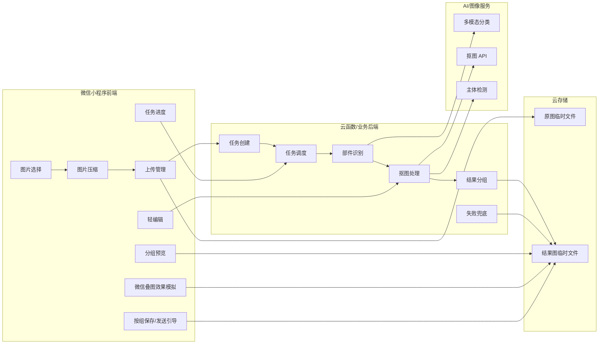
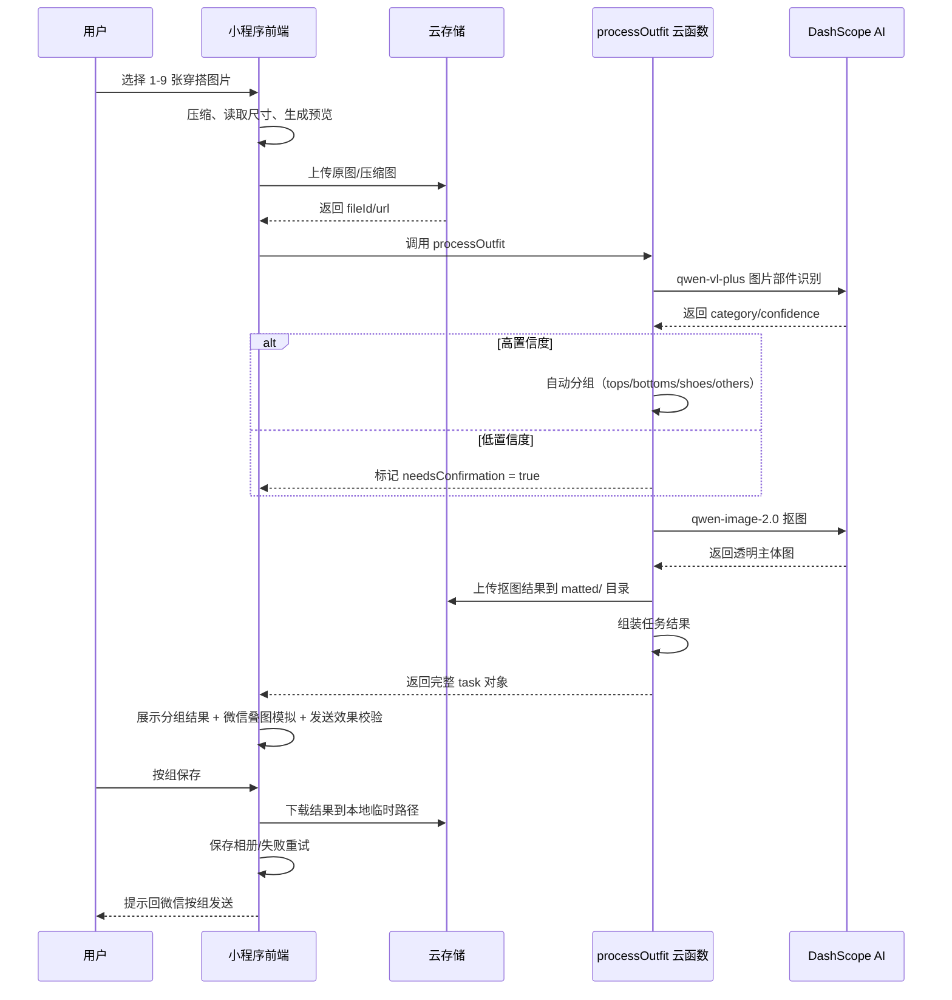
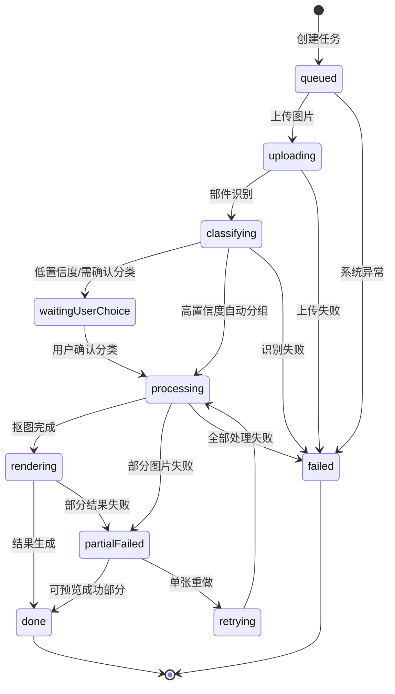

# WePicTool 技术方案设计

**版本：** v2.1
**日期：** 2026-07-18
**状态：** 覆盖阶段一到阶段三已有接口与实现；新增第 12 节叠图玩法管线技术规格（定位升级）

---

## 1. 技术选型

| 层级 | 技术 | 说明 |
|------|------|------|
| 前端 | 原生微信小程序 | 无需框架，直接调用微信原生 API |
| 后端 | CloudBase 云函数 | 单云函数 `processOutfit` 处理全链路 |
| 云存储 | CloudBase 云存储 | 原图临时文件、结果图临时文件 |
| AI 分类 | DashScope qwen-vl-plus | 多模态模型识别穿搭部件 |
| AI 抠图 | DashScope qwen-image-2.0 | 去除背景替换为纯白 |
| 白底合成 | 前端 Canvas | CloudBase 不支持 sharp 等原生 C++ 模块（错误码 145） |
| 数据持久化 | 本地 Storage | 设备本地轻量记录，不上云 |

### 1.1 为什么不用后端 Sharp 合成

2026-07-12 验证：尝试引入 `sharp` 做后端白底卡片合成，CloudBase 云函数不支持原生 C++ 模块（错误码 145）。已移除后端合成方案，改为前端 Canvas 实现。

### 1.2 关键依赖

```json
{
  "dependencies": {
    "wx-server-sdk": "latest",
    "axios": "latest"
  }
}
```

环境变量：`DASHSCOPE_API_KEY`（阿里云 DashScope API 密钥）

---

## 2. 系统架构

### 2.1 总体架构

```text
微信小程序前端
  -> 选图、压缩、上传、任务创建、进度展示、分组预览、轻编辑、保存/分享引导

CloudBase 云函数 (processOutfit)
  -> 阶段一：mock 分组（DASHSCOPE_API_KEY 未配置时）
  -> 阶段二：图片部件识别（DashScope qwen-vl-plus）
  -> 阶段三：抠图（DashScope qwen-image-2.0）

AI / 图像服务
  -> 多模态分类、抠图 API、主体检测

云存储
  -> 原图临时文件、结果图临时文件、任务记录
```

### 2.2 系统模块拆分



---

## 3. 目录职责

| 目录 | 职责 |
| --- | --- |
| `miniprogram/pages/index/` | 首页 Tab：选图、压缩、上传、创建任务 |
| `miniprogram/pages/record/` | 记录 Tab：本地历史任务列表、查看、再次生成 |
| `miniprogram/pages/profile/` | 我的 Tab：相册权限、反馈、分享、缓存清理 |
| `miniprogram/pages/result/` | 结果页（非 Tab）：白色聊天风格，分组展示、保存、改分类、发送引导 |
| `miniprogram/pages/preview/` | 微信预览页（非 Tab）：白色微信聊天风格，比例安全的堆叠卡片、展开/收起、滑动切换 |
| `miniprogram/app.json` | 全局页面路由与底部 Tab（首页 / 记录 / 我的）配置 |
| `miniprogram/config/env.js` | CloudBase 环境 ID 和本地预览开关 |
| `miniprogram/utils/task.js` | 任务规则、mock 分组、发送能力判断、图片尺寸计算 |
| `miniprogram/cloudfunctions/processOutfit/` | 云函数：阶段一 mock 处理 + 阶段二 AI 分类 + 阶段三抠图 |

---

## 4. 数据模型

### 4.1 任务契约

阶段一到阶段三都围绕同一个任务结构演进：

```js
{
  taskId: 'task_xxx',
  mode: 'outfit',
  status: 'done',
  progress: 100,
  groups: {
    tops: [],
    bottoms: [],
    shoes: [],
    others: []
  },
  results: [],
  sendability: {},
  createdAt: 0,
  expiredAt: 0,
  error: null
}
```

### 4.2 结果项结构

```js
{
  resultId: 'result_1',
  sourceImageId: 'image_1',
  category: 'tops',           // 前端分组：tops | bottoms | shoes | others
  classification: {           // AI 原始分类信息（mock 模式时为 null）
    type: 'tops',             // AI 原始标签：tops/bottoms/shoes/other_product/daily/unsupported/uncertain
    confidence: 0.95,
    needsConfirmation: false   // confidence < 0.8 时为 true
  },
  type: 'matted',             // 'matted' | 'original' | 'mockOriginal'
  status: 'done',
  localPath: '',
  fileId: 'cloud://xxx',      // 当前展示的文件 ID
  url: 'cloud://xxx',         // 当前展示的 URL
  mattedFileId: 'cloud://xxx', // 抠图结果文件 ID（未抠图为 null）
  mattedUrl: 'cloud://xxx',    // 抠图结果 URL（未抠图为 null）
  originalFileId: 'cloud://xxx',
  originalUrl: 'cloud://xxx',
  matted: true,                // 是否抠图成功
  width: 1600,
  height: 1200,
  size: 204800,
  order: 1,                   // 组内序号（从 1 开始）
  label: '上衣 1',             // 显示标签
  error: null                 // 分类/抠图错误信息
}
```

### 4.3 分组与发送能力

可处理主链路分组固定为：

```text
tops
bottoms
shoes
```

未处理素材统一进入：

```text
others
```

每组发送能力规则：

| 数量 | mode | 文案 |
| --- | --- | --- |
| 0 | `empty` | 暂无素材 |
| 1-2 | `normal` | 可保存，但可能按普通图片展示 |
| >= 3 | `stackable` | 可形成微信叠图效果 |

如果总素材数不少于 3，但所有有内容的主链路分组都少于 3 张，结果页必须提示：

```text
当前更适合普通发送；想要叠图效果，建议每组补到 3 张以上
```

---

## 5. 接口定义

### 5.1 processOutfit 云函数

#### 基本信息

| 项目 | 值 |
|------|-----|
| 云函数名 | `processOutfit` |
| 超时时间 | 60 秒 |
| 内存限制 | 256 MB |
| 依赖 | `wx-server-sdk`、`axios` |
| 环境变量 | `DASHSCOPE_API_KEY`（阿里云 DashScope API 密钥） |

#### 请求格式

```js
cloud.callFunction({
  name: 'processOutfit',
  data: {
    images: [
      {
        imageId: 'image_1',           // 图片标识
        fileId: 'cloud://xxx/xxx.jpg', // 云存储文件 ID（优先）
        url: 'cloud://xxx/xxx.jpg',    // 同 fileId，兼容字段
        width: 1600,                   // 图片宽度
        height: 1200,                  // 图片高度
        size: 204800                   // 文件大小（字节）
      }
      // ... 最多 9 张
    ]
  }
})
```

**字段说明：**

| 字段 | 类型 | 必填 | 说明 |
|------|------|------|------|
| `images` | Array | 是 | 图片列表，1-9 张 |
| `images[].imageId` | String | 否 | 图片标识，不传则自动生成 `image_{n}` |
| `images[].fileId` | String | 是* | 云存储文件 ID，以 `cloud://` 开头。与 url 二选一 |
| `images[].url` | String | 是* | 图片 URL，同 fileId |
| `images[].width` | Number | 否 | 图片宽度，默认 0 |
| `images[].height` | Number | 否 | 图片高度，默认 0 |
| `images[].size` | Number | 否 | 文件大小（字节），默认 0 |

#### 响应格式

```js
{
  taskId: 'task_1720000000000',
  mode: 'outfit',
  status: 'done',           // 'done' | 'failed'
  progress: 100,
  groups: {
    tops: [/* 结果项数组 */],
    bottoms: [],
    shoes: [],
    others: []
  },
  results: [/* 所有结果项的扁平数组 */],
  sendability: {
    threshold: 3,
    groups: {
      tops: { count: 2, mode: 'normal', message: '...' },
      bottoms: { count: 3, mode: 'stackable', message: '...' },
      shoes: { count: 0, mode: 'empty', message: '...' }
    },
    summary: {
      totalProcessableCount: 5,
      hasStackableGroup: true,
      allFilledGroupsBelowThreshold: false,
      message: ''
    }
  },
  localPreview: false,       // true 表示 mock 模式
  createdAt: 1720000000000,
  expiredAt: 1720259200000,  // createdAt + 72 小时
  error: null                // 或 { code: 'NO_IMAGES', message: '...' }
}
```

#### 前端调用方式

```js
// 在 miniprogram/pages/index/index.js 中调用
const res = await wx.cloud.callFunction({
  name: 'processOutfit',
  data: { images: uploadedImages }
});

const task = res.result;
// task.groups.tops, task.groups.bottoms, task.groups.shoes, task.groups.others
// task.sendability.summary.message 降级提示
```

---

## 6. 处理流程

### 6.1 云函数处理流程

```text
1. 接收图片列表（最多 9 张）
2. 规范化图片输入
3. 如果 DASHSCOPE_API_KEY 未配置 → 返回 mock 分组
4. 对每张图片调用 DashScope qwen-vl-plus 分类（并发 2 张）
   - 成功：记录 category + confidence
   - 429 限流：等待 3 秒重试 1 次
   - 其他失败：归入 others，needsConfirmation = true
5. 对 tops/bottoms/shoes 分类成功的图片调用 DashScope qwen-image-2.0 抠图（并发 2 张）
   - 成功：上传结果到云存储 matted/ 目录
   - 失败：保留原图，matted = false
6. 组装任务结果并返回
```

### 6.2 核心数据流



---

## 7. 状态机

### 7.1 任务状态

```text
queued
  → uploading
  → classifying
  → waitingUserChoice（低置信度 / 需改分类）
  → processing
  → rendering
  → done
```

部分失败状态：`partialFailed`，允许查看成功结果并对失败图单张重做。

完整状态列表：

```text
queued
uploading
classifying
waitingUserChoice
processing
rendering
done
partialFailed
failed
```

`partialFailed` 表示部分图片失败，成功图片仍可预览和保存。

### 7.2 状态流转



---

## 8. 错误处理

### 8.1 核心原则

**单张失败不阻断整批任务。**

### 8.2 错误场景一览

| 环节 | 错误场景 | 当前处理方式 | 用户可见行为 |
|------|----------|-------------|-------------|
| 图片选择 | 用户取消选择 | 静默处理 | 停留在首页，无提示 |
| 图片选择 | 选择超过 9 张 | `wx.chooseMedia` 内置限制 | 系统限制提示 |
| 压缩 | 图片尺寸获取失败 | 使用原图尺寸 | 无感知 |
| 云存储上传 | 云开发未开通/权限不足 | `isCloudPermissionError()` 检测 | 提示用户检查云开发配置 |
| 云存储上传 | 网络超时 | 上传失败 | 提示上传失败，可重试 |
| 云存储上传 | 云存储空间不足 | 上传失败 | 提示上传失败 |
| 云函数调用 | 云函数超时（60s） | 调用失败 | 提示处理失败，可重试 |
| 云函数调用 | DASHSCOPE_API_KEY 未配置 | 退回 mock 分组 | 使用本地 mock 分组，无 AI 分类 |
| AI 分类 | DashScope API 返回 429 限流 | 等待 3 秒后重试 1 次 | 用户无感知（延迟略增） |
| AI 分类 | DashScope API 返回其他错误 | 不重试，分类标记为 `others` + `needsConfirmation: true` | 进入"未处理素材区"，显示「待确认」角标 |
| AI 分类 | 返回内容解析失败 | 默认归入 `others`，confidence 为 0 | 进入"未处理素材区"，显示「待确认」角标 |
| AI 分类 | 网络断开 | 抛出异常，该图片分类失败 | 进入"未处理素材区" |
| 抠图 | DashScope qwen-image-2.0 调用失败 | `mattedResults[index] = null`，保留原图 | 结果页显示原图，可切换查看 |
| 抠图 | 抠图结果下载失败 | 同上，保留原图 | 同上 |
| 抠图 | 抠图结果上传到云存储失败 | 同上，保留原图 | 同上 |
| 保存到相册 | 用户拒绝相册授权 | 检测授权状态 | 引导用户进入微信设置页开启权限 |
| 保存到相册 | 保存过程中断 | 保存失败 | 提示保存失败，可重试 |

### 8.3 详细规则

#### 8.3.1 云存储权限错误

**检测函数：** `miniprogram/utils/task.js` → `isCloudPermissionError(error)`

**匹配规则：** 错误信息包含"云开发"、"云托管"、"cloud.uploadFile"、"cloud.callFunction"、"permission"、"权限"、"未启用云开发"、"开通云开发"之一。

**用户提示：** 引导用户确认 CloudBase 环境 ID 已配置、云开发已开通。

#### 8.3.2 AI 分类失败降级

**策略：** 分类失败的图片自动归入 `others`（未处理素材区），并标记 `needsConfirmation: true`。

**重试规则：**
- HTTP 429（限流）：等待 3 秒后重试 1 次。
- 其他错误：不重试，直接降级。

**并发控制：** 同时最多处理 2 张图片（`CONCURRENCY = 2`），避免触发限流。

#### 8.3.3 抠图失败降级

**策略：** 抠图失败的图片保留原图，不影响整批结果。结果项中 `matted: false`，前端可切换查看原图/白底图。

**不重试：** 当前抠图不做重试，避免延长整体处理时间。

#### 8.3.4 保存到相册权限

**流程：**
1. 调用 `wx.authorize({ scope: 'scope.writePhotosAlbum' })`。
2. 如果授权成功，执行保存。
3. 如果授权失败，调用 `wx.openSetting()` 引导用户到设置页。
4. 用户从设置页返回后重新检测授权状态。

#### 8.3.5 本地预览模式

**触发条件：** `miniprogram/config/env.js` 中 `CLOUD_ENV_ID` 为空。

**行为：** 跳过云存储上传和云函数调用，直接使用 `createMockTask()` 生成本地预览数据。不涉及网络请求，不会出错。

---

## 9. 云存储目录结构

```text
cloud://cloud1-d0g1blfsde474b168/
├── uploads/           # 用户上传的原图
│   └── {timestamp}_{imageId}.{ext}
└── matted/            # 抠图结果图
    └── {timestamp}_{imageId}.png
```

---

## 10. 技术取舍

| 能力 | 首版建议 | 原因 |
| --- | --- | --- |
| 图片合成 | 前端 Canvas | CloudBase 不支持 sharp 等原生 C++ 模块 |
| 后端合成 | 放弃 | 已验证 CloudBase 错误码 145，不可行 |
| 抠图 | DashScope qwen-image-2.0 | 已接入，去除背景替换为纯白 |
| 分类 | DashScope qwen-vl-plus | 已接入，支持置信度输出 |
| 存储 | 临时存储 24-72 小时 | 无账号体系下更安全 |
| 任务模式 | 同步云函数调用 | 当前阶段处理量可控，60s 超时足够 |
| 导出 | 先下载到本地临时路径 | 微信保存/分享依赖本地路径 |
| 分享 | 保存 + 发送引导 | 小程序无法直接发送图片到微信聊天 |

---

## 11. 待补充（后续阶段）

| 场景 | 当前状态 | 计划 |
|------|----------|------|
| 弱网/无网络 | 未专门处理 | 前端检测网络状态，无网时提前提示 |
| 云函数冷启动慢 | 用户可能等待较久 | 添加加载进度提示 |
| 大图片上传慢 | 无进度提示 | 分片上传或进度回调 |
| 图片清理策略 | 云存储文件无自动过期 | 配置 CloudBase 过期规则（24-72 小时） |
| 前端 Canvas 大图内存 | 待验证 | 监控 iOS/Android 内存占用，必要时降级 |

---

## 12. 叠图玩法管线技术规格

> 2026-07-18 定位升级新增。本节定义统一叠图管线的技术契约，玩法实现口径见 `PLAYBOOK.md` 第 3、4 章。以下能力除已标注"已有"的组件外均为待实现。

### 12.1 玩法模板注册表

每个玩法是一个注册项，新玩法 = 新增注册项并接入管线既有组件：

```js
// miniprogram/utils/playTemplates.js（待新增）
{
  id: 'big-text',              // 玩法唯一 ID，同时作为埋点 moduleId
  name: '大字滑卡',
  inputType: 'text',           // text | images | template-params | mixed
  composeFn: 'composeBigText', // 卡片生成函数名（前端 Canvas）
  cardCountRule: '每张 1 个字',
  minCards: 3,                 // ≥3 张硬约束（微信合并展示触发下限）
  fallbackStrategy: 'padCoverGuide', // 不足 minCards 时自动补封面卡 + 引导卡
  trackDimension: { moduleId: 'big-text', templateId: null }
}
```

### 12.2 6 段管线与现有代码对应关系

| 管线段 | 职责 | 对应代码 / 复用情况 |
| --- | --- | --- |
| 1. 输入器 | 选图 / 文字 / 模板参数 | 各玩法页面新增；图片输入复用 `pages/index` 的 `wx.chooseMedia` + 压缩链路 |
| 2. 卡片生成器 | 前端 Canvas 批量渲染卡片 | 复用 `miniprogram/utils/cardComposer.js`（导出 `composeCard`、`RATIO_MAP`、`GROUP_ANCHOR`、`DEFAULT_OPTIONS`）；文字类玩法按同一模式新增 compose 函数 |
| 3. 叠图预览 | 微信聊天效果预览 | 复用 `pages/preview`（白色微信聊天风格：比例安全堆叠卡片、展开/收起、滑动切换），通过 `eventChannel` 传入图组数据 |
| 4. 编号保存 | 文件名 01、02…… 控制发送顺序 | 复用 `pages/result` 的 `saveImagesSequentially(urls, successTitle)`，需抽为通用组件并叠加文件名编号 |
| 5. 发送引导 | 教用户按编号勾选 + 勾选「发送后合并展示」 | 在现有发送引导（`pages/result` 保存完成后的引导）基础上改版为通用浮层组件 |
| 6. 回流引导卡 | 末卡"用 WePicTool 做同款"，可开关 | 新增回流卡生成器（Canvas 模板），开关状态本地存储，埋点单独统计 |

### 12.3 msgSecCheck 云函数接入点

- 所有用户输入文字（大字滑卡文案、剧情滑卡称呼、盲盒抽卡自定义选项等）在生成卡片前统一过 `msgSecCheck`。
- 接入点放**云函数侧统一封装**：在 `cloudfunctions/` 新增（或在 `processOutfit` 旁独立）一个内容安全检测函数，前端在"生成"动作前调用；检测不通过则拦截并提示修改，不落盘、不生成卡片。
- 前端不得绕过该检测直接渲染用户文字到卡片。

### 12.4 翻页动画云托管 ffmpeg 备注

- 路线①素材库先行：预置动作帧序列，纯前端，无云端依赖。
- 路线②自定义抽帧：走**云托管**（容器制，可跑 ffmpeg）执行视频/GIF 抽帧并回传帧序列，绕开 CloudBase 云函数不支持原生 C++ 模块的限制（与 sharp 错误码 145 同因，见 1.1 节）。
- 帧数甜点区间 8–12 帧，上限 24 帧。
- 路线②上线前必须完成一次云托管抽帧验证（耗时 / 回传体积 / 费用），验证结论回填 `PROJECT_STATUS.md`。

### 12.5 埋点事件总表

已有 8 个事件（阶段五口径）：

| 事件 | 说明 |
| --- | --- |
| `task_created` | 任务创建 |
| `classification_completed` | AI 分类完成 |
| `category_changed` | 用户改分类 |
| `task_completed` | 任务完成 |
| `group_saved` | 按组保存 |
| `result_saved` | 结果保存 |
| `share_guide_clicked` | 点击分享/发送引导 |
| `retry_triggered` | 触发重试/重做 |

定位升级新增 6 个事件：

| 事件 | 说明 |
| --- | --- |
| `module_entered` | 进入某功能模块（带模块 ID） |
| `template_used` | 使用某玩法模板（带模板 ID） |
| `stack_saved` | 一叠图保存完成（带张数、玩法类型） |
| `send_guide_completed` | 看完发送引导并去发送 |
| `reflow_card_impression` | 回流引导卡随叠图生成/预览曝光 |
| `reflow_card_toggled` | 用户打开/关闭回流引导卡开关 |

玩法漏斗：`module_entered` → `template_used` → `stack_saved` → `send_guide_completed` → 分享转化。

### 12.6 叠图预览组件技术契约（1:1 还原）

> 2026-07-18 依据真机暗色模式录屏（`ui-reference/wx-merge-real-demo.mp4`）标定，高保真原型见 Blueprint Widget「WePicTool 三屏原型」（widget_7a0db4d4，其 `index.html` 为参考实现）。产品口径见 `PLAYBOOK.md` §3.4。`pages/preview` 按本节重写。

**组件输入（eventChannel 传入）：**

```js
{
  groups: [{ name: '上衣组', cards: [{ url, num: '01' }, ...] }, ...],
  theme: 'dark' | 'light',   // 为兼容旧调用方继续接收；页面固定渲染白色主题
  ratio: '1:1' | '4:5' | '3:4'
}
```

**状态机：**

```text
folded ⇄ folded（滑动循环翻页）
folded → expanded（点「展开 N」）→ folded（点「收起」）
folded / expanded --长按--> actionSheet（保存全部 / 转发）
expanded --点单张--> viewer（黑底大图，点任意处关闭）
```

**折叠态结构参数：**

| 项 | 值 |
| --- | --- |
| 手势舞台 | 屏宽 54%，最大视觉高度 150px；组消息行固定 164px，比例变化不改变聊天流高度 |
| 图片比例 | 优先 `composedRatio`，再任务 `ratio`，再源图宽高；在舞台内 `aspectFit`，不拉伸、不裁切 |
| 头像 | 32px 方形、圆角 5px，与卡片顶部对齐，间距 8px |
| 牌堆露边 | 后卡 `translateX(-8px) rotate(-.7deg) scale(.97)` 与 `translateX(+13px) rotate(1.1deg) scale(.94)`，z-index 3/2/1，左右均可见卡角 |
| 展开胶囊 | 紧贴牌堆左侧（距消息行左缘 24px）、相对消息行垂直居中；文字「展开 N」/「收起」；`rgba(0,0,0,.62)`，圆角 99px |
| 禁用元素 | 无层叠角标、无页码（早期原型误加，已删） |

**手势参数（折叠态）：**

| 阶段 | 参数 |
| --- | --- |
| 方向锁 | 首次位移超 8px 时判定：`abs(dx) > abs(dy)` 才接管；否则交还聊天纵向滚动 |
| 跟手 | `translateX(dx)` + `rotate(dx * 0.025°)`，clamp ±6°；拖动中禁用过渡 |
| 翻页阈值 | `abs(dx) > 卡宽 * 0.2` 或最近 120ms 采样速度 `abs(v) > 0.28px/ms` |
| 回弹 | 未达阈值：240ms `cubic-bezier(.18,.82,.2,1)` 回 identity |
| 飞出 | `translateX(±1.3 * 卡宽)` + `rotate(±18°)` + opacity→0，220ms `cubic-bezier(.3,0,.8,.2)` |
| 补位 | 固定节点轮转；后卡从左右露角平滑补位，240ms `cubic-bezier(.18,.82,.2,1)` |
| 循环 | 左滑 front→g2、g1→front、g2→g1；右滑反向；飞出卡瞬移入尾（`transition: none` 复位后恢复） |

**展开/收起参数：**

- 展开：折叠牌堆、展开首张及第 2~N 张在首屏即挂载，所有预览图关闭懒加载；展开时仅以 `hidden` 切换可见性。第 1 张留原位（同一消息行），第 2~N 张作为独立消息行（同一稳定舞台 + 各自右侧头像）入场：220ms `cubic-bezier(.2,.8,.2,1)` 的 `opacity 0→1 + translateY(10px→0)`，stagger 45ms；聊天流自然下推。
- 收起：反向 180ms ease-in，stagger 30ms 逆序，结束后仅隐藏扩展消息行，禁止销毁图片节点或触发重新解码。
- 展开态禁用牌堆手势；胶囊文案原地切换「展开 N」⇄「收起」，位置不变。展开列表必须以当前顶层节点为第一张，不能在用户翻页后跳回初始第一张。

**页面外壳：**

- 聊天背景、导航与输入栏均为 `#FFF`，细分隔线 `#EEE`；会话名固定「分享给好友」。
- 状态栏固定 `12:00`，消息时间固定「中午12:00」；不展示提示条、主题切换或模拟对话气泡。

**小程序实现口径：**

- 动画只用 `transform` / `opacity`（GPU 合成层），禁止改 `width/height/top/left` 触发重排；牌堆卡 `will-change: transform`。
- 手势用 `bindtouchstart/move/end` + 在卡片节点 `catchtouchmove` 仅在判定为横向后阻止冒泡（判定前不得 catch，否则聊天区无法纵向滚动）；或用 `movable-view` 以外的自定义实现时同此原则。
- 三张牌堆卡为**固定节点**（不随翻页重建），只轮转位置 class（front/g1/g2），卡片内容永不变更——天然循环、补位动画由 class 过渡自动完成。
- 展开消息行始终保留 WXML 图片节点，以 `hidden` + CSS animation（stagger 用内联 `animation-delay`）切换；viewer 用全屏 `position: fixed` 黑底容器。
- 每叠一个组件实例；页面接收多组时纵向排列多个固定高度折叠卡消息，典型 375px 视口须同时露出上衣、下装、鞋子与输入栏。
- 真机验收对照清单：白色外壳、12:00、54% 舞台、左右露角、比例安全适配、胶囊近牌堆、滑动跟手旋转、阈值/回弹手感、飞出渐隐、循环翻页、展开时无白屏重载与 stagger——与用户提供的真实微信视频并排逐项对比。

---

## 附录：用户路径到技术实现映射

| 用户动作 | 前端要做什么 | 后端要做什么 | 风险点 | 兜底方案 |
| --- | --- | --- | --- | --- |
| 进入小程序 | 初始化页面、检查基础库能力 | 无 | 微信版本能力差异 | 低版本隐藏不可用能力 |
| 选图/拍照 | 调用图片选择能力，限制 1-9 张 | 无 | 图片太大、格式不兼容 | 前端压缩，后端 HEIC 转码 |
| 上传 | 显示上传进度 | 写入云存储并创建任务 | 网络慢、上传失败 | 单张重传，不重选整批 |
| 部件识别 | 展示"正在识别上衣/下装/鞋子" | 返回分类、置信度、建议组 | 上衣/下装/鞋子错分；其他素材误入主链路 | 前端允许改分类，非 MVP 类别先收纳不处理 |
| 抠图处理 | 展示单张进度 | 调用抠图 API，保留透明主体 | 边缘差、主体缺失 | 质量检测 + 单张重做 |
| 白底卡片合成 | 前端 Canvas 合成 | 返回抠图结果 | 主体大小不一致、浅色衣物看不清 | 统一缩放、锚点、描边/阴影规则 |
| 分组预览 | 按组展示结果 | 返回结果元数据 | 用户看不懂怎么发微信，分类后组内不足 3 张 | 模拟微信叠图效果 + 发送效果校验 + 降级提醒 |
| 轻编辑 | 改分类、删除、排序、重做 | 按参数重新渲染 | 状态复杂 | 编辑项收敛为固定参数 |
| 保存/分享 | 下载本地临时路径，调用保存能力 | 无或生成最终图 | 批量保存失败、授权失败 | 队列保存，失败重试，授权引导 |


---

## 附录 B：抠图模型备选清单（2026-07-19 实测）

### B.1 当前在用

- **默认模型：`qwen-image-edit-plus`**（写在 `processOutfit/index.js` 的 `MATTING_MODEL` 默认值里）
- 云函数环境变量 `DASHSCOPE_MATTING_MODEL` 可覆盖默认值，**优先级最高**——改模型不用重新部署代码，但反过来：若环境变量残留旧值，改代码默认值不会生效。
- 分类模型固定为 `qwen-vl-plus`（不在本附录范围）。

### B.2 可用模型（与云函数请求形态兼容，实测出图正常）

实测条件：真实 API Key、multimodal-generation 同步端点、浅色 T 恤商品图；结果图均去背干净、纯白底、浅色衣物轮廓完整（存于 `scripts/.matting-test-out/`，可用 `scripts/test-matting-models.cjs` 复测）。

| 优先级 | 模型 | 单张耗时 | 免费额度（2026-07-19） | 备注 |
| --- | --- | --- | --- | --- |
| 1（当前默认） | `qwen-image-edit-plus` | ~7s | 剩 100/100，2026-08-31 过期 | 速度快、额度满，首选 |
| 2 | `qwen-image-2.0` | ~5s | **仅剩 10/100**，2026-08-31 过期 | 最快但额度告急，只作应急 |
| 3 | `qwen-image-edit` | ~17.5s | 剩 99/100，2026-08-31 过期 | 质量与 plus 相当，慢 |
| 4 | `qwen-image-2.0-pro` | ~15s | 剩 98/100，2026-08-31 过期 | 备用 |

> 额度为全账号共享、会随调用消耗，切换前建议先到百炼「用量 & 费用 → 免费额度」页确认最新余量。
> 账号开启了「免费额度用完即停（FreeTierOnly）」：某模型额度耗尽后调用返回 **403 `AllocationQuota.FreeTierOnly`**，表现为结果页全部卡片「已用原图」——出现此症状先查额度再换模型。

### B.3 不可用模型（勿选）

| 模型 | 失败原因 |
| --- | --- |
| `wanx-v1` | 文生图模型，走 text2image image-synthesis 异步任务 API，与本端点不兼容，报 400 `InvalidParameter: url error`（额度 500 再多也用不了） |
| `qwen-image-edit-plus-2025-11-25` | 快照型号未开放，报 400 `InvalidParameter: Model not exist.` |

### B.4 换模型操作（二选一）

1. **免部署**：开发者工具 → 云开发控制台 → 云函数 → `processOutfit` → 配置 → 环境变量，把 `DASHSCOPE_MATTING_MODEL` 改为上表任一可用模型名，保存即生效；
2. **改代码**：改 `processOutfit/index.js` 中 `MATTING_MODEL` 默认值，然后重新「上传并部署」。

换完后建议本地先验证：`DASHSCOPE_API_KEY=sk-xxx node scripts/test-matting-models.cjs [图片路径]`。
