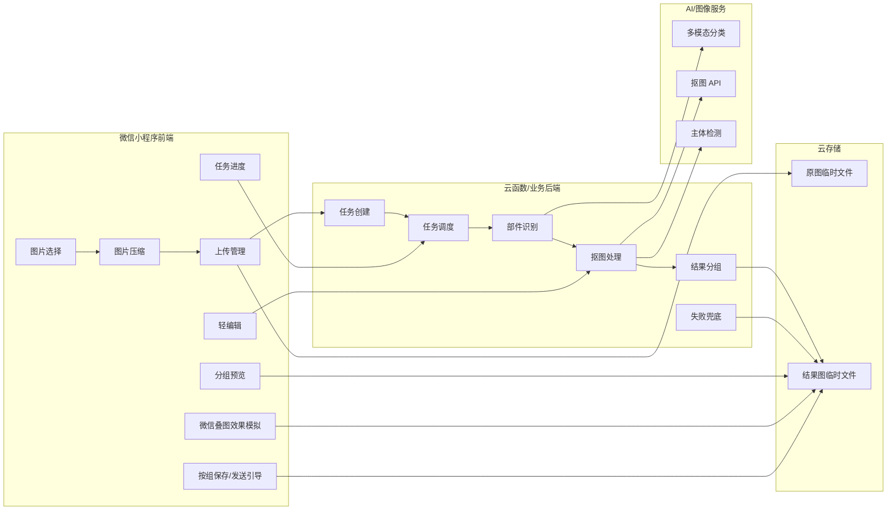
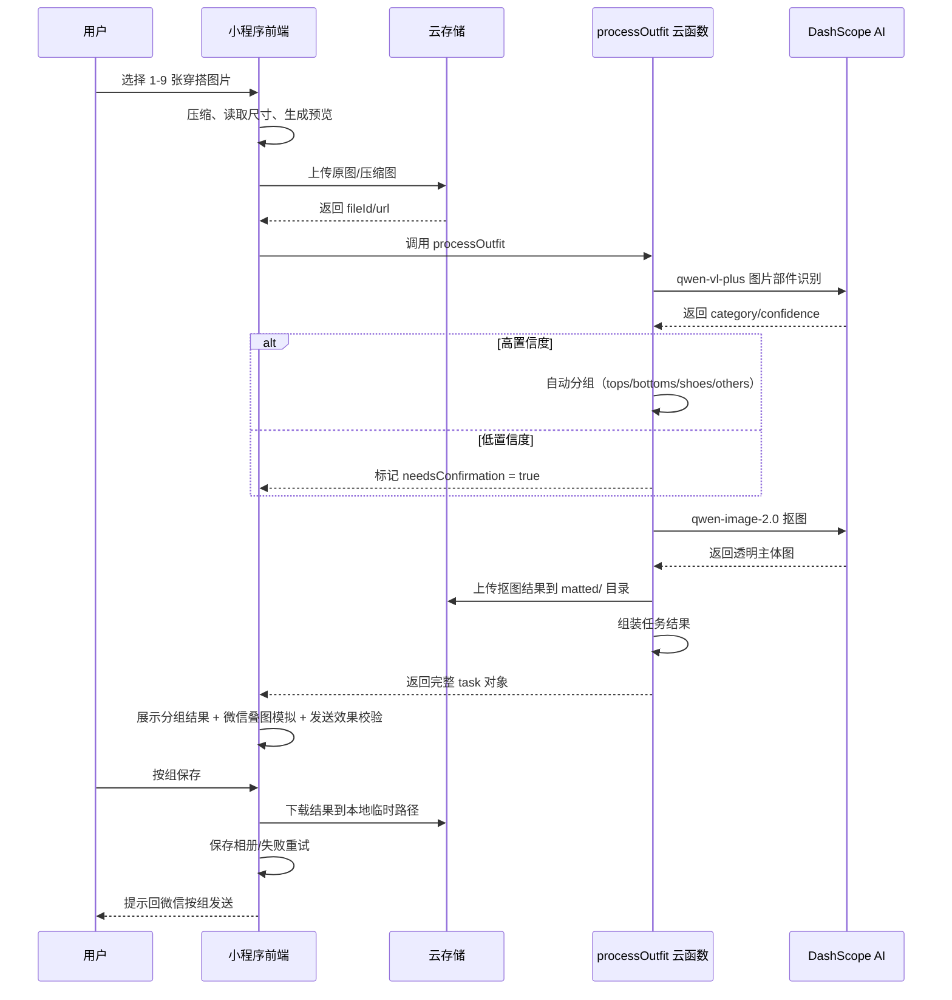
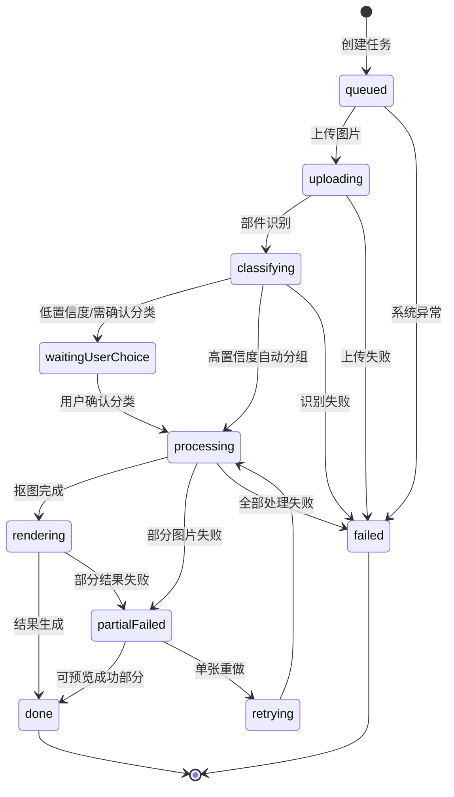

# WePicTool 技术方案设计

**版本：** v2.0
**日期：** 2026-07-13
**状态：** 覆盖阶段一到阶段三已有接口与实现

---

## 1. 技术选型

| 层级 | 技术 | 说明 |
|------|------|------|
| 前端 | 原生微信小程序 | 无需框架，直接调用微信原生 API |
| 后端 | CloudBase 云函数 | 单云函数 `processOutfit` 处理全链路 |
| 云存储 | CloudBase 云存储 | 原图临时文件、结果图临时文件 |
| AI 分类 | DashScope qwen-vl-plus | 多模态模型识别穿搭部件 |
| AI 抠图 | DashScope qwen-image-2.0 | 去除背景替换为纯白 |
| 白底合成 | 前端 Canvas | CloudBase 不支持 sharp 等原生 C++ 模块（错误码 145） |
| 数据持久化 | 本地 Storage | 设备本地轻量记录，不上云 |

### 1.1 为什么不用后端 Sharp 合成

2026-07-12 验证：尝试引入 `sharp` 做后端白底卡片合成，CloudBase 云函数不支持原生 C++ 模块（错误码 145）。已移除后端合成方案，改为前端 Canvas 实现。

### 1.2 关键依赖

```json
{
  "dependencies": {
    "wx-server-sdk": "latest",
    "axios": "latest"
  }
}
```

环境变量：`DASHSCOPE_API_KEY`（阿里云 DashScope API 密钥）

---

## 2. 系统架构

### 2.1 总体架构

```text
微信小程序前端
  -> 选图、压缩、上传、任务创建、进度展示、分组预览、轻编辑、保存/分享引导

CloudBase 云函数 (processOutfit)
  -> 阶段一：mock 分组（DASHSCOPE_API_KEY 未配置时）
  -> 阶段二：图片部件识别（DashScope qwen-vl-plus）
  -> 阶段三：抠图（DashScope qwen-image-2.0）

AI / 图像服务
  -> 多模态分类、抠图 API、主体检测

云存储
  -> 原图临时文件、结果图临时文件、任务记录
```

### 2.2 系统模块拆分



---

## 3. 目录职责

| 目录 | 职责 |
| --- | --- |
| `miniprogram/pages/index/` | 首页 Tab：选图、压缩、上传、创建任务 |
| `miniprogram/pages/record/` | 记录 Tab：本地历史任务列表、查看、再次生成 |
| `miniprogram/pages/profile/` | 我的 Tab：相册权限、反馈、分享、缓存清理 |
| `miniprogram/pages/result/` | 结果页（非 Tab）：白色聊天风格，分组展示、保存、改分类、发送引导 |
| `miniprogram/pages/preview/` | 微信预览页（非 Tab）：深色微信聊天风格，堆叠卡片、展开/收起、滑动切换 |
| `miniprogram/app.json` | 全局页面路由与底部 Tab（首页 / 记录 / 我的）配置 |
| `miniprogram/config/env.js` | CloudBase 环境 ID 和本地预览开关 |
| `miniprogram/utils/task.js` | 任务规则、mock 分组、发送能力判断、图片尺寸计算 |
| `miniprogram/cloudfunctions/processOutfit/` | 云函数：阶段一 mock 处理 + 阶段二 AI 分类 + 阶段三抠图 |

---

## 4. 数据模型

### 4.1 任务契约

阶段一到阶段三都围绕同一个任务结构演进：

```js
{
  taskId: 'task_xxx',
  mode: 'outfit',
  status: 'done',
  progress: 100,
  groups: {
    tops: [],
    bottoms: [],
    shoes: [],
    others: []
  },
  results: [],
  sendability: {},
  createdAt: 0,
  expiredAt: 0,
  error: null
}
```

### 4.2 结果项结构

```js
{
  resultId: 'result_1',
  sourceImageId: 'image_1',
  category: 'tops',           // 前端分组：tops | bottoms | shoes | others
  classification: {           // AI 原始分类信息（mock 模式时为 null）
    type: 'tops',             // AI 原始标签：tops/bottoms/shoes/other_product/daily/unsupported/uncertain
    confidence: 0.95,
    needsConfirmation: false   // confidence < 0.8 时为 true
  },
  type: 'matted',             // 'matted' | 'original' | 'mockOriginal'
  status: 'done',
  localPath: '',
  fileId: 'cloud://xxx',      // 当前展示的文件 ID
  url: 'cloud://xxx',         // 当前展示的 URL
  mattedFileId: 'cloud://xxx', // 抠图结果文件 ID（未抠图为 null）
  mattedUrl: 'cloud://xxx',    // 抠图结果 URL（未抠图为 null）
  originalFileId: 'cloud://xxx',
  originalUrl: 'cloud://xxx',
  matted: true,                // 是否抠图成功
  width: 1600,
  height: 1200,
  size: 204800,
  order: 1,                   // 组内序号（从 1 开始）
  label: '上衣 1',             // 显示标签
  error: null                 // 分类/抠图错误信息
}
```

### 4.3 分组与发送能力

可处理主链路分组固定为：

```text
tops
bottoms
shoes
```

未处理素材统一进入：

```text
others
```

每组发送能力规则：

| 数量 | mode | 文案 |
| --- | --- | --- |
| 0 | `empty` | 暂无素材 |
| 1-2 | `normal` | 可保存，但可能按普通图片展示 |
| >= 3 | `stackable` | 可形成微信叠图效果 |

如果总素材数不少于 3，但所有有内容的主链路分组都少于 3 张，结果页必须提示：

```text
当前更适合普通发送；想要叠图效果，建议每组补到 3 张以上
```

---

## 5. 接口定义

### 5.1 processOutfit 云函数

#### 基本信息

| 项目 | 值 |
|------|-----|
| 云函数名 | `processOutfit` |
| 超时时间 | 60 秒 |
| 内存限制 | 256 MB |
| 依赖 | `wx-server-sdk`、`axios` |
| 环境变量 | `DASHSCOPE_API_KEY`（阿里云 DashScope API 密钥） |

#### 请求格式

```js
cloud.callFunction({
  name: 'processOutfit',
  data: {
    images: [
      {
        imageId: 'image_1',           // 图片标识
        fileId: 'cloud://xxx/xxx.jpg', // 云存储文件 ID（优先）
        url: 'cloud://xxx/xxx.jpg',    // 同 fileId，兼容字段
        width: 1600,                   // 图片宽度
        height: 1200,                  // 图片高度
        size: 204800                   // 文件大小（字节）
      }
      // ... 最多 9 张
    ]
  }
})
```

**字段说明：**

| 字段 | 类型 | 必填 | 说明 |
|------|------|------|------|
| `images` | Array | 是 | 图片列表，1-9 张 |
| `images[].imageId` | String | 否 | 图片标识，不传则自动生成 `image_{n}` |
| `images[].fileId` | String | 是* | 云存储文件 ID，以 `cloud://` 开头。与 url 二选一 |
| `images[].url` | String | 是* | 图片 URL，同 fileId |
| `images[].width` | Number | 否 | 图片宽度，默认 0 |
| `images[].height` | Number | 否 | 图片高度，默认 0 |
| `images[].size` | Number | 否 | 文件大小（字节），默认 0 |

#### 响应格式

```js
{
  taskId: 'task_1720000000000',
  mode: 'outfit',
  status: 'done',           // 'done' | 'failed'
  progress: 100,
  groups: {
    tops: [/* 结果项数组 */],
    bottoms: [],
    shoes: [],
    others: []
  },
  results: [/* 所有结果项的扁平数组 */],
  sendability: {
    threshold: 3,
    groups: {
      tops: { count: 2, mode: 'normal', message: '...' },
      bottoms: { count: 3, mode: 'stackable', message: '...' },
      shoes: { count: 0, mode: 'empty', message: '...' }
    },
    summary: {
      totalProcessableCount: 5,
      hasStackableGroup: true,
      allFilledGroupsBelowThreshold: false,
      message: ''
    }
  },
  localPreview: false,       // true 表示 mock 模式
  createdAt: 1720000000000,
  expiredAt: 1720259200000,  // createdAt + 72 小时
  error: null                // 或 { code: 'NO_IMAGES', message: '...' }
}
```

#### 前端调用方式

```js
// 在 miniprogram/pages/index/index.js 中调用
const res = await wx.cloud.callFunction({
  name: 'processOutfit',
  data: { images: uploadedImages }
});

const task = res.result;
// task.groups.tops, task.groups.bottoms, task.groups.shoes, task.groups.others
// task.sendability.summary.message 降级提示
```

---

## 6. 处理流程

### 6.1 云函数处理流程

```text
1. 接收图片列表（最多 9 张）
2. 规范化图片输入
3. 如果 DASHSCOPE_API_KEY 未配置 → 返回 mock 分组
4. 对每张图片调用 DashScope qwen-vl-plus 分类（并发 2 张）
   - 成功：记录 category + confidence
   - 429 限流：等待 3 秒重试 1 次
   - 其他失败：归入 others，needsConfirmation = true
5. 对 tops/bottoms/shoes 分类成功的图片调用 DashScope qwen-image-2.0 抠图（并发 2 张）
   - 成功：上传结果到云存储 matted/ 目录
   - 失败：保留原图，matted = false
6. 组装任务结果并返回
```

### 6.2 核心数据流



---

## 7. 状态机

### 7.1 任务状态

```text
queued
  → uploading
  → classifying
  → waitingUserChoice（低置信度 / 需改分类）
  → processing
  → rendering
  → done
```

部分失败状态：`partialFailed`，允许查看成功结果并对失败图单张重做。

完整状态列表：

```text
queued
uploading
classifying
waitingUserChoice
processing
rendering
done
partialFailed
failed
```

`partialFailed` 表示部分图片失败，成功图片仍可预览和保存。

### 7.2 状态流转



---

## 8. 错误处理

### 8.1 核心原则

**单张失败不阻断整批任务。**

### 8.2 错误场景一览

| 环节 | 错误场景 | 当前处理方式 | 用户可见行为 |
|------|----------|-------------|-------------|
| 图片选择 | 用户取消选择 | 静默处理 | 停留在首页，无提示 |
| 图片选择 | 选择超过 9 张 | `wx.chooseMedia` 内置限制 | 系统限制提示 |
| 压缩 | 图片尺寸获取失败 | 使用原图尺寸 | 无感知 |
| 云存储上传 | 云开发未开通/权限不足 | `isCloudPermissionError()` 检测 | 提示用户检查云开发配置 |
| 云存储上传 | 网络超时 | 上传失败 | 提示上传失败，可重试 |
| 云存储上传 | 云存储空间不足 | 上传失败 | 提示上传失败 |
| 云函数调用 | 云函数超时（60s） | 调用失败 | 提示处理失败，可重试 |
| 云函数调用 | DASHSCOPE_API_KEY 未配置 | 退回 mock 分组 | 使用本地 mock 分组，无 AI 分类 |
| AI 分类 | DashScope API 返回 429 限流 | 等待 3 秒后重试 1 次 | 用户无感知（延迟略增） |
| AI 分类 | DashScope API 返回其他错误 | 不重试，分类标记为 `others` + `needsConfirmation: true` | 进入"未处理素材区"，显示「待确认」角标 |
| AI 分类 | 返回内容解析失败 | 默认归入 `others`，confidence 为 0 | 进入"未处理素材区"，显示「待确认」角标 |
| AI 分类 | 网络断开 | 抛出异常，该图片分类失败 | 进入"未处理素材区" |
| 抠图 | DashScope qwen-image-2.0 调用失败 | `mattedResults[index] = null`，保留原图 | 结果页显示原图，可切换查看 |
| 抠图 | 抠图结果下载失败 | 同上，保留原图 | 同上 |
| 抠图 | 抠图结果上传到云存储失败 | 同上，保留原图 | 同上 |
| 保存到相册 | 用户拒绝相册授权 | 检测授权状态 | 引导用户进入微信设置页开启权限 |
| 保存到相册 | 保存过程中断 | 保存失败 | 提示保存失败，可重试 |

### 8.3 详细规则

#### 8.3.1 云存储权限错误

**检测函数：** `miniprogram/utils/task.js` → `isCloudPermissionError(error)`

**匹配规则：** 错误信息包含"云开发"、"云托管"、"cloud.uploadFile"、"cloud.callFunction"、"permission"、"权限"、"未启用云开发"、"开通云开发"之一。

**用户提示：** 引导用户确认 CloudBase 环境 ID 已配置、云开发已开通。

#### 8.3.2 AI 分类失败降级

**策略：** 分类失败的图片自动归入 `others`（未处理素材区），并标记 `needsConfirmation: true`。

**重试规则：**
- HTTP 429（限流）：等待 3 秒后重试 1 次。
- 其他错误：不重试，直接降级。

**并发控制：** 同时最多处理 2 张图片（`CONCURRENCY = 2`），避免触发限流。

#### 8.3.3 抠图失败降级

**策略：** 抠图失败的图片保留原图，不影响整批结果。结果项中 `matted: false`，前端可切换查看原图/白底图。

**不重试：** 当前抠图不做重试，避免延长整体处理时间。

#### 8.3.4 保存到相册权限

**流程：**
1. 调用 `wx.authorize({ scope: 'scope.writePhotosAlbum' })`。
2. 如果授权成功，执行保存。
3. 如果授权失败，调用 `wx.openSetting()` 引导用户到设置页。
4. 用户从设置页返回后重新检测授权状态。

#### 8.3.5 本地预览模式

**触发条件：** `miniprogram/config/env.js` 中 `CLOUD_ENV_ID` 为空。

**行为：** 跳过云存储上传和云函数调用，直接使用 `createMockTask()` 生成本地预览数据。不涉及网络请求，不会出错。

---

## 9. 云存储目录结构

```text
cloud://cloud1-d0g1blfsde474b168/
├── uploads/           # 用户上传的原图
│   └── {timestamp}_{imageId}.{ext}
└── matted/            # 抠图结果图
    └── {timestamp}_{imageId}.png
```

---

## 10. 技术取舍

| 能力 | 首版建议 | 原因 |
| --- | --- | --- |
| 图片合成 | 前端 Canvas | CloudBase 不支持 sharp 等原生 C++ 模块 |
| 后端合成 | 放弃 | 已验证 CloudBase 错误码 145，不可行 |
| 抠图 | DashScope qwen-image-2.0 | 已接入，去除背景替换为纯白 |
| 分类 | DashScope qwen-vl-plus | 已接入，支持置信度输出 |
| 存储 | 临时存储 24-72 小时 | 无账号体系下更安全 |
| 任务模式 | 同步云函数调用 | 当前阶段处理量可控，60s 超时足够 |
| 导出 | 先下载到本地临时路径 | 微信保存/分享依赖本地路径 |
| 分享 | 保存 + 发送引导 | 小程序无法直接发送图片到微信聊天 |

---

## 11. 待补充（后续阶段）

| 场景 | 当前状态 | 计划 |
|------|----------|------|
| 弱网/无网络 | 未专门处理 | 前端检测网络状态，无网时提前提示 |
| 云函数冷启动慢 | 用户可能等待较久 | 添加加载进度提示 |
| 大图片上传慢 | 无进度提示 | 分片上传或进度回调 |
| 图片清理策略 | 云存储文件无自动过期 | 配置 CloudBase 过期规则（24-72 小时） |
| 前端 Canvas 大图内存 | 待验证 | 监控 iOS/Android 内存占用，必要时降级 |

---

## 附录：用户路径到技术实现映射

| 用户动作 | 前端要做什么 | 后端要做什么 | 风险点 | 兜底方案 |
| --- | --- | --- | --- | --- |
| 进入小程序 | 初始化页面、检查基础库能力 | 无 | 微信版本能力差异 | 低版本隐藏不可用能力 |
| 选图/拍照 | 调用图片选择能力，限制 1-9 张 | 无 | 图片太大、格式不兼容 | 前端压缩，后端 HEIC 转码 |
| 上传 | 显示上传进度 | 写入云存储并创建任务 | 网络慢、上传失败 | 单张重传，不重选整批 |
| 部件识别 | 展示"正在识别上衣/下装/鞋子" | 返回分类、置信度、建议组 | 上衣/下装/鞋子错分；其他素材误入主链路 | 前端允许改分类，非 MVP 类别先收纳不处理 |
| 抠图处理 | 展示单张进度 | 调用抠图 API，保留透明主体 | 边缘差、主体缺失 | 质量检测 + 单张重做 |
| 白底卡片合成 | 前端 Canvas 合成 | 返回抠图结果 | 主体大小不一致、浅色衣物看不清 | 统一缩放、锚点、描边/阴影规则 |
| 分组预览 | 按组展示结果 | 返回结果元数据 | 用户看不懂怎么发微信，分类后组内不足 3 张 | 模拟微信叠图效果 + 发送效果校验 + 降级提醒 |
| 轻编辑 | 改分类、删除、排序、重做 | 按参数重新渲染 | 状态复杂 | 编辑项收敛为固定参数 |
| 保存/分享 | 下载本地临时路径，调用保存能力 | 无或生成最终图 | 批量保存失败、授权失败 | 队列保存，失败重试，授权引导 |
