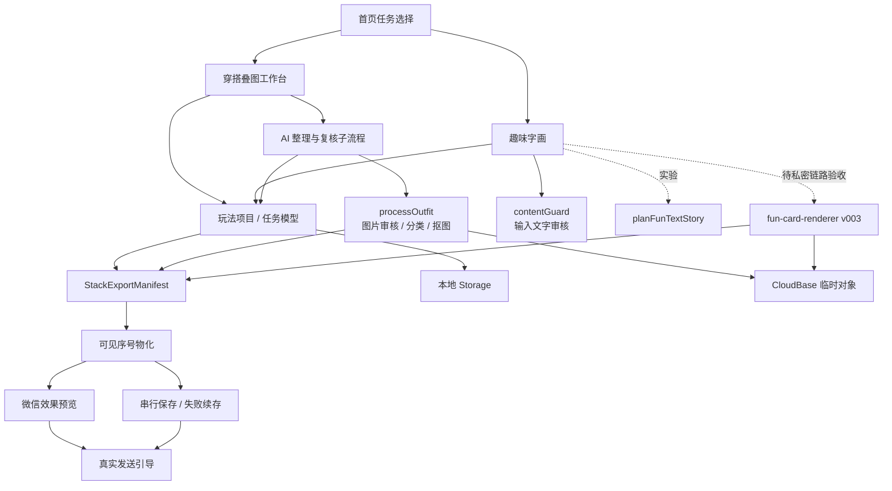
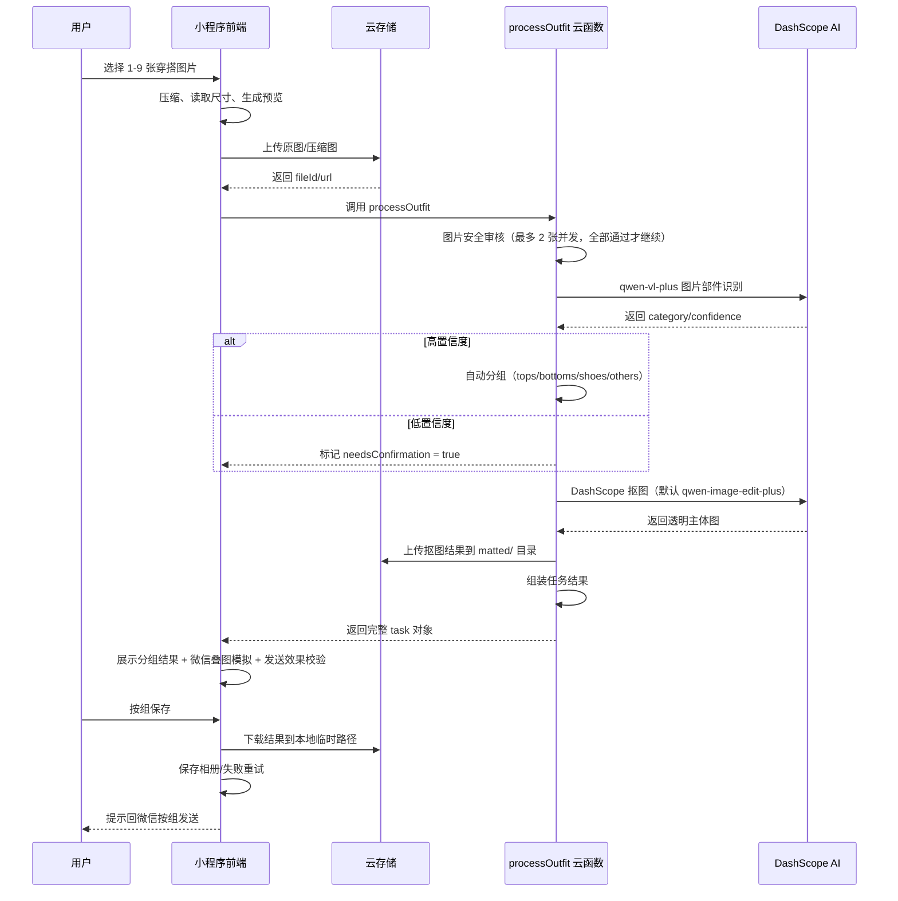
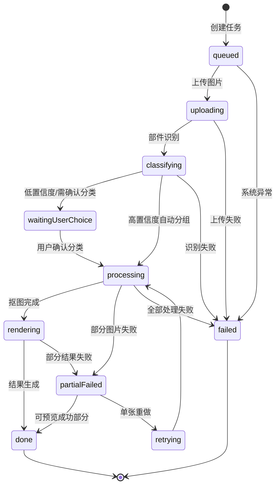

# WePicTool 技术方案设计

2026-09-12 分支增量：趣味字画ENABLE_FUN_OFFLINE_PREVIEW开启时，本机规则规划、异步字体资源分包、OpenType轮廓Canvas绘制；不调用AI/审核/renderer预览。其他玩法不变，保存和微信成品预览仍使用审核后的云端产物。实现边界见`../superpowers/specs/2026-09-12-local-font-editor.md`。

**版本：** v2.4
**日期：** 2026-09-05
**状态：** 记录 `codex/unified-stack-export` 当前代码与工作树契约。首页、统一导出和预览改版均未合并或发布；趣味字画 P2.2 仍是计划外实验；生产与双端证据边界以 `../current.md` 为准。

---

## 1. 技术选型

| 层级 | 技术 | 说明 |
|------|------|------|
| 前端 | 原生微信小程序 | 无需框架，直接调用微信原生 API |
| 后端 | CloudBase 云函数 | `processOutfit` 处理图片审核与 AI 链路，`contentGuard` 审核用户反馈文本 |
| 趣味字画字体 | renderer 镜像内 `assets/fonts/`；客户端 CloudBase CDN 暂留回滚 | 三款字体经 Docker 构建期非空检查并在进程启动期一次注册；客户端 CDN 仍待双端验收 |
| 趣味字画渲染 | CloudBase 云托管，Node 20 bookworm-slim + `node:http` | v004 已完成 Linux 源码构建、正常启动和 100% 切流；`callContainer` 三字体中文成图、低清预览、1080 PNG、二次审核与生命周期尚未完成生产验收 |
| 故事规划实验 | `planFunTextStory` 云函数 | P2.2 计划外实验代码；发布范围、部署和模型 API key 未确认 |
| 云存储 | CloudBase 云存储 | 原图临时文件、结果图临时文件 |
| AI 分类 | DashScope qwen-vl-plus | 多模态模型识别穿搭部件 |
| AI 抠图 | DashScope `qwen-image-edit-plus`（默认，可由环境变量覆盖） | 去除背景替换为纯白 |
| 白底合成 | 前端 Canvas | CloudBase 不支持 sharp 等原生 C++ 模块（错误码 145） |
| 数据持久化 | 本地 Storage | 设备本地轻量记录，不上云 |

### 1.1 为什么不用后端 Sharp 合成

2026-07-12 验证：尝试引入 `sharp` 做后端白底卡片合成，CloudBase 云函数不支持原生 C++ 模块（错误码 145）。已移除后端合成方案，改为前端 Canvas 实现。

### 1.2 关键依赖

```json
{
  "dependencies": {
    "wx-server-sdk": "latest",
    "axios": "latest"
  }
}
```

环境变量：穿搭链路使用 `DASHSCOPE_API_KEY`。P2.2 实验另读取服务端 `LLM_API_KEY`（可回退 `DASHSCOPE_API_KEY`）、`LLM_BASE_URL` 和 `LLM_MODEL`；这些值不得进入小程序包，线上尚未配置验证。

---

## 2. 系统架构

### 2.1 总体架构

```text
微信小程序产品外壳
  -> 首页任务选择 / 记录 / 我的
  -> 穿搭叠图（手动分层 / AI 整理）| 趣味字画

玩法层
  -> 玩法注册与素材包
  -> 项目/任务模型
  -> 各玩法输入、候选、轻编辑与卡片生成

共享叠图层
  -> StackExportManifest（叠、顺序、封面、指纹）
  -> SequenceBadgeComposer（01…N 最终图片物化）
  -> 微信效果预览（只读 exportUrl）
  -> ImageExporter（串行保存、进度、失败续存）

云端增强
  -> processOutfit：图片审核、分类、抠图
  -> contentGuard：用户/模型文字审核
  -> renderer 镜像内字体（服务端正常路径）
  -> CloudBase 静态托管字体 HTTPS/CDN（客户端加载与回滚，真机待验收）
  -> fun-card-renderer：服务端低清预览与 1080 PNG（v003 在线，私密入口未验收）
  -> planFunTextStory：P2.2 结构化故事规划实验（未纳入发布）

存储
  -> 小程序本地 Storage：项目与轻量记录
  -> CloudBase 临时对象：上传图、抠图和趣味字画结果
```

### 2.2 系统模块拆分


```mermaid
flowchart TD
    HOME["首页任务选择"] --> DRESS["穿搭叠图工作台"]
    HOME --> FUN["趣味字画"]
    DRESS --> OUTFIT["AI 整理与复核子流程"]

    DRESS --> PROJECT["玩法项目 / 任务模型"]
    FUN --> PROJECT
    OUTFIT --> PROJECT

    OUTFIT --> PO["processOutfit\n图片审核 / 分类 / 抠图"]
    FUN --> CG["contentGuard\n输入文字审核"]
    FUN -.实验.-> PLAN["planFunTextStory"]
    FUN -.待私密链路验收.-> RENDER["fun-card-renderer v003"]

    PROJECT --> MANIFEST["StackExportManifest"]
    PO --> MANIFEST
    RENDER --> MANIFEST
    MANIFEST --> BADGE["可见序号物化"]
    BADGE --> PREVIEW["微信效果预览"]
    BADGE --> SAVE["串行保存 / 失败续存"]
    PREVIEW --> GUIDE["真实发送引导"]
    SAVE --> GUIDE

    PROJECT --> LOCAL["本地 Storage"]
    PO --> CLOUD["CloudBase 临时对象"]
    RENDER --> CLOUD
```

---

## 3. 目录职责

| 目录 | 职责 |
| --- | --- |
| `miniprogram/pages/index/` | 首页 Tab：穿搭叠图/趣味字画选择、单一共享预览与当前玩法行动 |
| `miniprogram/pages/dressup/` | 统一穿搭工作台：四部位项目、手动/AI 双添加方式、待确认素材、排序、预览和保存 |
| `miniprogram/pages/outfit-import/` | AI 添加子流程：1–9 张选图、处理进度、分类复核、原图/白底选择与 eventChannel 回填 |
| `miniprogram/pages/record/` | 记录 Tab：本地历史任务列表、查看、再次生成 |
| `miniprogram/pages/profile/` | 我的 Tab：相册权限、反馈、分享、缓存清理 |
| `miniprogram/pages/result/` | 结果页（非 Tab）：白色聊天风格，分组展示、保存、改分类、发送引导 |
| `miniprogram/pages/preview/` | 微信效果预览页（非 Tab）：固定会话壳层、普通/深色主题、唯一聊天滚动区、独立牌堆滑动/展开/保存 |
| `miniprogram/pages/fun-text*/`、`template-result/` | 趣味字画输入、三候选、聚焦编辑与高清结果页 |
| `miniprogram/config/funTextCases.js`、`funTextStrategies.js` | 12 个结构化案例与 8 种规则叙事玩法；案例只引用白名单键，不携带大图 |
| `miniprogram/config/stylePacks.js`、`fontFeels.js` | 7 套视觉包的背景/配色注册表与 3 种字体字感 |
| `miniprogram/utils/funTextProject.js`、`funTextTransform.js` | 不可变项目编辑、20 步历史、恢复操作，以及装饰拖动/缩放/旋转的纯计算 |
| `miniprogram/app.json` | 全局页面路由与底部 Tab（首页 / 记录 / 我的）配置 |
| `miniprogram/config/env.js` | CloudBase 环境 ID、renderer 服务名/字体地址、本地预览、趣味字画入口和穿搭 AI 添加开关 |
| `miniprogram/utils/task.js` | 任务规则、mock 分组、发送能力判断、图片尺寸计算 |
| `miniprogram/cloudfunctions/processOutfit/` | 云函数：阶段一 mock 处理 + 阶段二 AI 分类 + 阶段三抠图 |
| `miniprogram/cloudfunctions/contentGuard/` | 云函数：使用微信内容安全接口审核用户反馈文本 |
| `miniprogram/cloudfunctions/planFunTextStory/` | P2.2 实验云函数：结构化故事规划、单次修复和候选文字复核；未部署 |
| `miniprogram/cloudhosting/fun-card-renderer/` | 独立 Node 20 渲染器：镜像内字体、360 预览、1080 成品、审核与云存储；v004 已部署运行，`callContainer` 三字体中文成图、云存储和内容安全线上验收待完成 |

---

## 4. 数据模型

### 4.1 任务契约

阶段一到阶段三都围绕同一个任务结构演进：

```js
{
  taskId: 'task_xxx',
  mode: 'outfit',
  status: 'done',
  progress: 100,
  groups: {
    tops: [],
    bottoms: [],
    shoes: [],
    others: []
  },
  results: [],
  sendability: {},
  createdAt: 0,
  expiredAt: 0,
  error: null
}
```

### 4.2 结果项结构

```js
{
  resultId: 'result_1',
  sourceImageId: 'image_1',
  category: 'tops',           // 前端分组：tops | bottoms | shoes | others
  classification: {           // AI 原始分类信息（mock 模式时为 null）
    type: 'tops',             // AI 原始标签：tops/bottoms/shoes/other_product/daily/unsupported/uncertain
    confidence: 0.95,
    needsConfirmation: false   // confidence < 0.8 时为 true
  },
  type: 'matted',             // 'matted' | 'original' | 'mockOriginal'
  status: 'done',
  localPath: '',
  fileId: 'cloud://xxx',      // 当前展示的文件 ID
  url: 'cloud://xxx',         // 当前展示的 URL
  mattedFileId: 'cloud://xxx', // 抠图结果文件 ID（未抠图为 null）
  mattedUrl: 'cloud://xxx',    // 抠图结果 URL（未抠图为 null）
  originalFileId: 'cloud://xxx',
  originalUrl: 'cloud://xxx',
  matted: true,                // 是否抠图成功
  width: 1600,
  height: 1200,
  size: 204800,
  order: 1,                   // 组内序号（从 1 开始）
  label: '上衣 1',             // 显示标签
  error: null                 // 分类/抠图错误信息
}
```

### 4.3 分组与发送能力

可处理主链路分组固定为：

```text
tops
bottoms
shoes
```

未处理素材统一进入：

```text
others
```

每组发送能力规则：

| 数量 | mode | 文案 |
| --- | --- | --- |
| 0 | `empty` | 暂无素材 |
| 1-2 | `normal` | 可保存，但可能按普通图片展示 |
| >= 3 | `stackable` | 可形成微信叠图效果 |

如果总素材数不少于 3，但所有有内容的主链路分组都少于 3 张，结果页必须提示：

```text
当前更适合普通发送；想要叠图效果，建议每组补到 3 张以上
```

### 4.4 统一穿搭项目与 AI 回填

`layeredDressup` 项目继续以 `head / tops / bottoms / shoes` 为四个最终叠，并增加向后兼容的 `pendingItems: []`。老草稿缺少该字段时按空数组读取。手动与 AI 素材共享同一 item 结构；AI 项额外保留 `sourceImageId`、原图/处理图地址和 `classification`。

`outfit-import` 只持有本批临时选择和复核状态，通过 `acceptAiImport` eventChannel 返回 `{ groups, pendingItems, ratio }`。工作台按 `sourceImageId` 或稳定图片地址去重后追加；不覆盖现有组。每组最多 12 张，低置信度、`others` 和容量溢出项进入最多 36 张的待确认区。任何追加、归类或删除都使旧 manifest 和保存续传状态失效。

### 4.5 趣味字画场景与编辑历史

趣味字画继续使用 version 1 项目外壳，以附加可选字段兼容已有本地记录；不把仅增加白名单样式元数据误判为不兼容协议升级。新建场景稳定记录：

```js
{
  sceneId: 'scene_01',
  order: 1,
  role: 'hook',
  width: 1080,
  height: 1080,
  stylePackId: 'pink-note-v1',
  backgroundVariantKey: 'pink-note-soft',
  paletteKey: 'pink-note-rose',
  fontFeelKey: 'marker',
  background: { assetKey: 'pink-note-01', color: '#FCE4EC' },
  layers: [
    {
      id: 'text_main',
      type: 'text',
      fontKey: 'marker',
      fontFamily: 'LXGWMarkerGothic'
    }
  ]
}
```

- 背景变体、配色、字体和装饰均由客户端与 renderer 双端白名单校验；带 `paletteKey` 的场景不接受配色表以外的文字颜色。
- 编辑历史只快照 `candidates` 与当前选择，不递归保存历史本身，最多保留 20 步；无实际变化的操作不创建历史。
- 装饰手势移动时只更新页面预览，`touchend` 才把最终坐标、缩放和旋转提交为一步历史。
- 任意有效编辑都会清空旧 `renderedCards` 并把项目恢复为 `draft`；后续 fingerprint、manifest 和保存续传游标必须重新生成。
- 当前不支持用户照片层；每卡一张照片及其裁切能力留到单独的阶段 C。

---

## 5. 接口定义

### 5.1 processOutfit 云函数

#### 基本信息

| 项目 | 值 |
|------|-----|
| 云函数名 | `processOutfit` |
| 超时时间 | 60 秒 |
| 内存限制 | 256 MB |
| 依赖 | `wx-server-sdk`、`axios` |
| 环境变量 | `DASHSCOPE_API_KEY`（阿里云 DashScope API 密钥） |

#### 请求格式

```js
cloud.callFunction({
  name: 'processOutfit',
  data: {
    images: [
      {
        imageId: 'image_1',           // 图片标识
        fileId: 'cloud://xxx/xxx.jpg', // 云存储文件 ID（优先）
        url: 'cloud://xxx/xxx.jpg',    // 同 fileId，兼容字段
        width: 1600,                   // 图片宽度
        height: 1200,                  // 图片高度
        size: 204800                   // 文件大小（字节）
      }
      // ... 最多 9 张
    ]
  }
})
```

**字段说明：**

| 字段 | 类型 | 必填 | 说明 |
|------|------|------|------|
| `images` | Array | 是 | 图片列表，1-9 张 |
| `images[].imageId` | String | 否 | 图片标识，不传则自动生成 `image_{n}` |
| `images[].fileId` | String | 是* | 云存储文件 ID，以 `cloud://` 开头。与 url 二选一 |
| `images[].url` | String | 是* | 图片 URL，同 fileId |
| `images[].width` | Number | 否 | 图片宽度，默认 0 |
| `images[].height` | Number | 否 | 图片高度，默认 0 |
| `images[].size` | Number | 否 | 文件大小（字节），默认 0 |

#### 响应格式

```js
{
  taskId: 'task_1720000000000',
  mode: 'outfit',
  status: 'done',           // 'done' | 'failed'
  progress: 100,
  groups: {
    tops: [/* 结果项数组 */],
    bottoms: [],
    shoes: [],
    others: []
  },
  results: [/* 所有结果项的扁平数组 */],
  sendability: {
    threshold: 3,
    groups: {
      tops: { count: 2, mode: 'normal', message: '...' },
      bottoms: { count: 3, mode: 'stackable', message: '...' },
      shoes: { count: 0, mode: 'empty', message: '...' }
    },
    summary: {
      totalProcessableCount: 5,
      hasStackableGroup: true,
      allFilledGroupsBelowThreshold: false,
      message: ''
    }
  },
  localPreview: false,       // true 表示 mock 模式
  createdAt: 1720000000000,
  expiredAt: 1720259200000,  // createdAt + 72 小时
  error: null                // 或 { code: 'NO_IMAGES', message: '...' }
}
```

#### 前端调用方式

```js
// 在 miniprogram/pages/index/index.js 中调用
const res = await wx.cloud.callFunction({
  name: 'processOutfit',
  data: { images: uploadedImages }
});

const task = res.result;
// task.groups.tops, task.groups.bottoms, task.groups.shoes, task.groups.others
// task.sendability.summary.message 降级提示
```

---

## 6. 处理流程

### 6.1 云函数处理流程

```text
1. 接收图片列表（最多 9 张）
2. 规范化图片输入
3. 如果 DASHSCOPE_API_KEY 未配置 → 返回 mock 分组
4. 对每张图片调用 DashScope qwen-vl-plus 分类（并发 2 张）
   - 成功：记录 category + confidence
   - 429 限流：等待 3 秒重试 1 次
   - 其他失败：归入 others，needsConfirmation = true
5. 对 tops/bottoms/shoes 分类成功的图片调用 DashScope 抠图模型（默认 qwen-image-edit-plus，并发 2 张）
   - 成功：上传结果到云存储 matted/ 目录
   - 失败：保留原图，matted = false
6. 组装任务结果并返回
```

### 6.2 核心数据流


```mermaid
sequenceDiagram
    participant U as 用户
    participant FE as 小程序前端
    participant ST as 云存储
    participant CF as processOutfit 云函数
    participant AI as DashScope AI

    U->>FE: 选择 1-9 张穿搭图片
    FE->>FE: 压缩、读取尺寸、生成预览
    FE->>ST: 上传原图/压缩图
    ST-->>FE: 返回 fileId/url
    FE->>CF: 调用 processOutfit
    CF->>CF: 图片安全审核（最多 2 张并发，全部通过才继续）
    CF->>AI: qwen-vl-plus 图片部件识别
    AI-->>CF: 返回 category/confidence

    alt 高置信度
        CF->>CF: 自动分组（tops/bottoms/shoes/others）
    else 低置信度
        CF-->>FE: 标记 needsConfirmation = true
    end

    CF->>AI: DashScope 抠图（默认 qwen-image-edit-plus）
    AI-->>CF: 返回透明主体图
    CF->>ST: 上传抠图结果到 matted/ 目录
    CF->>CF: 组装任务结果
    CF-->>FE: 返回完整 task 对象
    FE->>FE: 展示分组结果 + 微信叠图模拟 + 发送效果校验
    U->>FE: 按组保存
    FE->>ST: 下载结果到本地临时路径
    FE->>FE: 保存相册/失败重试
    FE-->>U: 提示回微信按组发送
```

---

## 7. 状态机

### 7.1 任务状态

```text
queued
  → uploading
  → classifying
  → waitingUserChoice（低置信度 / 需改分类）
  → processing
  → rendering
  → done
```

部分失败状态：`partialFailed`，允许查看成功结果并对失败图单张重做。

完整状态列表：

```text
queued
uploading
classifying
waitingUserChoice
processing
rendering
done
partialFailed
failed
```

`partialFailed` 表示部分图片失败，成功图片仍可预览和保存。

### 7.2 状态流转


```mermaid
stateDiagram-v2
    [*] --> queued: 创建任务
    queued --> uploading: 上传图片
    uploading --> classifying: 部件识别
    classifying --> waitingUserChoice: 低置信度/需确认分类
    waitingUserChoice --> processing: 用户确认分类
    classifying --> processing: 高置信度自动分组
    processing --> rendering: 抠图完成
    rendering --> done: 结果生成
    processing --> partialFailed: 部分图片失败
    rendering --> partialFailed: 部分结果失败
    partialFailed --> done: 可预览成功部分
    partialFailed --> retrying: 单张重做
    retrying --> processing
    queued --> failed: 系统异常
    uploading --> failed: 上传失败
    classifying --> failed: 识别失败
    processing --> failed: 全部处理失败
    failed --> [*]
    done --> [*]
```

---

## 8. 错误处理

### 8.1 核心原则

**单张失败不阻断整批任务。**

### 8.2 错误场景一览

| 环节 | 错误场景 | 当前处理方式 | 用户可见行为 |
|------|----------|-------------|-------------|
| 图片选择 | 用户取消选择 | 静默处理 | 停留在首页，无提示 |
| 图片选择 | 选择超过 9 张 | `wx.chooseMedia` 内置限制 | 系统限制提示 |
| 压缩 | 图片尺寸获取失败 | 使用原图尺寸 | 无感知 |
| 云存储上传 | 云开发未开通/权限不足 | `isCloudPermissionError()` 检测 | 提示用户检查云开发配置 |
| 云存储上传 | 网络超时 | 上传失败 | 提示上传失败，可重试 |
| 云存储上传 | 云存储空间不足 | 上传失败 | 提示上传失败 |
| 云函数调用 | 云函数超时（60s） | 调用失败 | 提示处理失败，可重试 |
| 云函数调用 | DASHSCOPE_API_KEY 未配置 | 退回 mock 分组 | 使用本地 mock 分组，无 AI 分类 |
| AI 分类 | DashScope API 返回 429 限流 | 等待 3 秒后重试 1 次 | 用户无感知（延迟略增） |
| AI 分类 | DashScope API 返回其他错误 | 不重试，分类标记为 `others` + `needsConfirmation: true` | 进入"未处理素材区"，显示「待确认」角标 |
| AI 分类 | 返回内容解析失败 | 默认归入 `others`，confidence 为 0 | 进入"未处理素材区"，显示「待确认」角标 |
| AI 分类 | 网络断开 | 抛出异常，该图片分类失败 | 进入"未处理素材区" |
| 抠图 | DashScope 抠图模型调用失败 | `mattedResults[index] = null`，保留原图 | 结果页显示原图，可切换查看 |
| 抠图 | 抠图结果下载失败 | 同上，保留原图 | 同上 |
| 抠图 | 抠图结果上传到云存储失败 | 同上，保留原图 | 同上 |
| 保存到相册 | 用户拒绝相册授权 | 检测授权状态 | 引导用户进入微信设置页开启权限 |
| 保存到相册 | 保存过程中断 | 保存失败 | 提示保存失败，可重试 |

### 8.3 详细规则

#### 8.3.1 云存储权限错误

**检测函数：** `miniprogram/utils/task.js` → `isCloudPermissionError(error)`

**匹配规则：** 错误信息包含"云开发"、"云托管"、"cloud.uploadFile"、"cloud.callFunction"、"permission"、"权限"、"未启用云开发"、"开通云开发"之一。

**用户提示：** 引导用户确认 CloudBase 环境 ID 已配置、云开发已开通。

#### 8.3.2 AI 分类失败降级

**策略：** 分类失败的图片自动归入 `others`（未处理素材区），并标记 `needsConfirmation: true`。

**重试规则：**
- HTTP 429（限流）：等待 3 秒后重试 1 次。
- 其他错误：不重试，直接降级。

**并发控制：** 同时最多处理 2 张图片（`CONCURRENCY = 2`），避免触发限流。

#### 8.3.3 抠图失败降级

**策略：** 抠图失败的图片保留原图，不影响整批结果。结果项中 `matted: false`，前端可切换查看原图/白底图。

**不重试：** 当前抠图不做重试，避免延长整体处理时间。

#### 8.3.4 保存到相册权限

**流程：**
1. 调用 `wx.authorize({ scope: 'scope.writePhotosAlbum' })`。
2. 如果授权成功，执行保存。
3. 如果授权失败，调用 `wx.openSetting()` 引导用户到设置页。
4. 用户从设置页返回后重新检测授权状态。

#### 8.3.5 本地预览模式

**触发条件：** `miniprogram/config/env.js` 中 `CLOUD_ENV_ID` 为空。

**行为：** 跳过云存储上传和云函数调用，直接使用 `createMockTask()` 生成本地预览数据。不涉及网络请求，不会出错。

---

## 9. 云存储目录结构

```text
cloud://cloud1-d0g1blfsde474b168/
├── uploads/           # 用户上传的原图
│   └── {timestamp}_{imageId}.{ext}
└── matted/            # 抠图结果图
    └── {timestamp}_{imageId}.png
```

---

## 10. 技术取舍

| 能力 | 首版建议 | 原因 |
| --- | --- | --- |
| 图片合成 | 前端 Canvas | CloudBase 不支持 sharp 等原生 C++ 模块 |
| 后端合成 | 放弃 | 已验证 CloudBase 错误码 145，不可行 |
| 抠图 | DashScope `qwen-image-edit-plus`（默认） | 已接入，去除背景替换为纯白；部署环境变量可覆盖 |
| 分类 | DashScope qwen-vl-plus | 已接入，支持置信度输出 |
| 存储 | 穿搭上传/抠图沿用 24–72 小时产品策略；趣味字画 `funtext/` 固定为 2 天（48 小时目标） | 无账号体系下更安全；renderer 回滚失败由生命周期和残留扫描补偿 |
| 任务模式 | 同步云函数调用 | 当前阶段处理量可控，60s 超时足够 |
| 导出 | 先下载到本地临时路径 | 微信保存/分享依赖本地路径 |
| 分享 | 保存 + 发送引导 | 小程序无法直接发送图片到微信聊天 |

---

## 11. 待补充（后续阶段）

| 场景 | 当前状态 | 计划 |
|------|----------|------|
| 弱网/无网络 | 未专门处理 | 前端检测网络状态，无网时提前提示 |
| 云函数冷启动慢 | 用户可能等待较久 | 添加加载进度提示 |
| 大图片上传慢 | 无进度提示 | 分片上传或进度回调 |
| 趣味字画渲染图清理 | 代码回滚为 best-effort，云端规则尚未配置验证 | 对 `funtext/` 固定配置 2 天（48 小时目标）过期，并监控/补偿超期残留 |
| 前端 Canvas 大图内存 | 待验证 | 监控 iOS/Android 内存占用，必要时降级 |

---

## 12. 叠图玩法管线技术规格

> 2026-07-18 定位升级新增，2026-09-04 按统一导出实现校准。本节定义统一叠图管线的技术契约，玩法实现口径见 `PLAYBOOK.md` 第 3、4 章。P2.1 对应代码与自动化已存在，但外部部署/设备证据仍缺失；P2.2 是未纳入阶段一计划的实验代码。

### 12.1 玩法模板注册表

每个玩法是一个注册项，新玩法 = 新增注册项并接入管线既有组件：

```js
// miniprogram/config/playRegistry.js（当前版本 1 注册项）
{
  id: 'fun-text-stack',        // 玩法唯一 ID，同时作为埋点 moduleId
  version: 1,
  title: '趣味字画',
  status: 'available',         // 仅代码注册状态，不等于已发布
  inputType: 'text',
  renderer: 'fun-card-scene',
  preview: 'single-stack',
  exporter: 'ordered-sequence'
}
```

### 12.2 6 段管线与现有代码对应关系

| 管线段 | 职责 | 对应代码 / 复用情况 |
| --- | --- | --- |
| 1. 输入器 | 选图 / 文字 / 模板参数 | 图片输入复用 `pages/index`；趣味字画使用 `pages/fun-text`，入口可由 `ENABLE_FUN_TEXT_STACK_ENTRY` 关闭 |
| 2. 卡片生成器 | 把玩法计划转为可编辑场景并批量渲染 | 图片玩法复用 `cardComposer.js`；趣味字画已有规则策略、候选校验、`sceneComposer` 和小程序/云托管双渲染适配器。P2.2 AI 调度仅为实验 |
| 3. 叠图预览 | 微信聊天效果预览 | `pages/preview` 优先接收已物化 manifest，只读取 `exportUrl`；旧 `{task}` / `{groups}` 输入保留一个兼容周期；真实微信表现未验证 |
| 4. 编号保存 | 让用户识别并按正确顺序选择图片 | `stackExportManifest.js` 提供顺序事实源，`sequenceBadgeComposer.js` 把 `01…N` 写入最终图片，`imageExporter.js` 按 manifest 串行保存并支持带组身份的断点续存。`wx.saveImageToPhotosAlbum` 不能指定目标文件名或系统相册排序，因此不作相册顺序保证 |
| 5. 发送引导 | 教用户按编号勾选 + 勾选「发送后合并展示」 | 三个结果页统一提示“每次只发送一叠、按图片角标勾选、确认 01 在第一位、勾选发送后合并展示”；真实聊天未验证 |
| 6. 回流引导卡 | 末卡"用 WePicTool 做同款"，可开关 | 尚未实现；不在当前统一导出设计范围内 |

### 12.3 用户生成内容安全门禁

- 用户上传的穿搭图片由 `processOutfit` 在调用 DashScope 前执行微信 `security.imgSecCheck`；审核按最多 2 张并发执行，必须所有图片通过后才启动分类与抠图。
- `errCode === 0` 为通过，`errCode === 87014` 为违规；任何其他响应、限流、超时或 OpenAPI 异常均按审核服务不可用处理，默认不放行，不得降级生成 mock 结果。
- 图片违规或审核服务异常时，云函数返回 `CONTENT_UNSAFE` 或 `SAFETY_UNAVAILABLE`，前端停留在当前页并显示非技术性提示；违规任务的 `cloud://` 源图片会尽力删除，删除失败仅记录日志且不影响拦截。
- 意见反馈文本由独立 `contentGuard` 云函数调用 `security.msgSecCheck`；仅 `ok === true` 时才允许写入本地 `wepictool_feedbacks`，违规或安全服务异常均不保存。
- `processOutfit/config.json` 必须声明 `security.imgSecCheck`，`contentGuard/config.json` 必须声明 `security.msgSecCheck`；客户端不得保存 AppSecret，也不得绕过云函数直连安全接口。
- 趣味字画用户输入先走 `contentGuard`；`fun-card-renderer` 在绘制/上传前再次聚合审核 `sourceText` 与全部可见文字。小程序 POST 始终只经 `wx.cloud.callContainer`，服务端要求非空 `x-cloudbase-context` + `x-wx-openid`，客户端不得传身份/context/秘密。头部不是独立公网鉴权。三款字体固定进入 renderer 镜像并在启动期一次注册，正常服务端渲染无字体 CDN 依赖；CloudBase 静态字体仅供客户端加载与回滚。非模拟运行及启用入口的发布预检要求 `FUN_CARD_RENDERER_ACCESS_MODE=call-container-only`。2026-09-07 v004 已在线且平台变量未包含字体 URL；网络资源和公网开关按用户要求暂停，真实 `callContainer` 尚未验收，因此仍为 NOT READY。审核缺失、异常或未知响应均不得渲染。
- P2.2 的模型新增文字必须在场景合成前复查；但该云函数目前只是计划外实验代码，未完成发布范围确认、线上权限/模型配置或真机验证，不能据此声明生产门禁已验收。

### 12.4 翻页动画云托管 ffmpeg 备注

- 路线①素材库先行：预置动作帧序列，纯前端，无云端依赖。
- 路线②自定义抽帧：走**云托管**（容器制，可跑 ffmpeg）执行视频/GIF 抽帧并回传帧序列，绕开 CloudBase 云函数不支持原生 C++ 模块的限制（与 sharp 错误码 145 同因，见 1.1 节）。
- 帧数甜点区间 8–12 帧，上限 24 帧。
- 路线②上线前必须完成一次云托管抽帧验证（耗时 / 回传体积 / 费用），验证结论记录到当天 `docs/iterations/` 日志，并同步必要的当前状态或路线图。

### 12.5 埋点事件规划

当前功能分支尚未建立统一事件上报模块，以下事件是既有规划口径，不代表代码中已经完成采集或上报。

原规划的 8 个事件（阶段五口径）：

| 事件 | 说明 |
| --- | --- |
| `task_created` | 任务创建 |
| `classification_completed` | AI 分类完成 |
| `category_changed` | 用户改分类 |
| `task_completed` | 任务完成 |
| `group_saved` | 按组保存 |
| `result_saved` | 结果保存 |
| `share_guide_clicked` | 点击分享/发送引导 |
| `retry_triggered` | 触发重试/重做 |

定位升级计划增加 6 个事件：

| 事件 | 说明 |
| --- | --- |
| `module_entered` | 进入某功能模块（带模块 ID） |
| `template_used` | 使用某玩法模板（带模板 ID） |
| `stack_saved` | 一叠图保存完成（带张数、玩法类型） |
| `send_guide_completed` | 看完发送引导并去发送 |
| `reflow_card_impression` | 回流引导卡随叠图生成/预览曝光 |
| `reflow_card_toggled` | 用户打开/关闭回流引导卡开关 |

玩法漏斗：`module_entered` → `template_used` → `stack_saved` → `send_guide_completed` → 分享转化。

### 12.6 叠图预览组件技术契约（微信会话仿真）

> 2026-09-05 依据用户真机截图、项目内微信录屏和 `docs/superpowers/specs/2026-09-05-wechat-preview-simulation-redesign.md` 重新标定。页面只模拟发送后的观看与滑动效果，不声明已进入微信或可以直发指定好友。

**组件输入（eventChannel 传入）：**

```js
{
  manifest: {
    version: 1,
    badgeStyleVersion: 1,
    fingerprint,
    ratio,
    stacks: [{
      stackId,
      title,
      canExport,
      cards: [{ cardId, sequence: 1, sequenceLabel: '01', isCover: true, sourceUrl, exportUrl }]
    }]
  },
  selectedStackIds: ['tops'],
  ratio: '1:1' | '4:5' | '3:4'
}
```

- manifest 模式只读取 `exportUrl`，选中叠任一卡片缺少 `exportUrl` 时 fail closed，不回退到 `sourceUrl`。
- 预览保持 manifest 叠顺序和组内顺序；`sequenceLabel='01'` 与 `isCover=true` 是封面身份，不由预览页重排。
- 旧 `{ task }` 与 `{ groups, ratio }` 输入保留一个兼容周期并标记为 legacy；它们可继续打开历史记录，但不被宣称为带可见编号的最终导出。
- 图片内角标属于导出层，不进入玩法 scene JSON、远端 render fingerprint 或长期记录缓存；记录重开时从原始项目与渲染卡片重建。

**状态机：**

```text
folded ⇄ folded（滑动循环翻页）
folded → expanded（点「展开 N」）→ folded（点「收起」）
folded / expanded --长按--> actionSheet（保存这张 / 保存这一组）
folded / expanded --点单张--> wx.previewImage（当前组黑底大图浏览；不可用时回退内置 viewer）
light ⇄ dark（太阳/月亮合并按钮即时切换并本地保存）
```

**折叠态结构参数：**

| 项 | 值 |
| --- | --- |
| 图片消息通道 | 从屏宽扣除 20px 边距、36px 头像、8px 头像间距、58px 展开胶囊、10px 胶囊间距和 10px 露边；舞台宽 `min(38vw, 164px, 剩余通道)` |
| 图片比例 | 优先 `composedRatio`，再任务 `ratio`，再源图宽高；穿搭 4:5 输出在折叠叠图中使用接近微信的 3:4 缩略框并居中裁切，点击大图仍展示完整原图；最大高为 `min(51vw, 219px)` |
| 375px 标定 | 1:1 为 143×143px，穿搭 4:5 缩略框为 143×191px，3:4 为 143×191px；320px 宽设备的穿搭缩略框为 122×163px |
| 头像 | 36px 方形、圆角 5px，与图片消息垂直居中，间距 8px |
| 牌堆露边 | 后卡 `translateX(-8px) rotate(-.7deg) scale(.97)` 与 `translateX(+10px) rotate(1deg) scale(.94)`，z-index 3/2/1，左右均可见卡角 |
| 展开胶囊 | 作为消息行内的正常 flex 项紧贴牌堆左侧 10px；浅色/深色主题分别使用半透明浅灰/深灰底；文字「展开 N」/「收起」 |
| 禁用元素 | 无层叠角标、无页码（早期原型误加，已删） |

**手势参数（折叠态）：**

| 阶段 | 参数 |
| --- | --- |
| 方向锁 | 首次位移超 8px 后继续判断意图：横向需 `abs(dx) > abs(dy) * 1.15`，纵向需 `abs(dy) > abs(dx) * 1.05`；模糊斜滑暂不接管 |
| 跟手 | 顶卡 `translateX(dx)` + `rotate(dx * 0.025°)`，clamp ±5°；后两卡按 `abs(dx)/(卡宽*0.75)` 的进度同步向下一槽补位；拖动中全部禁用过渡 |
| 翻页阈值 | `abs(dx) > 卡宽 * 0.2`，或最近 120ms 速度 `abs(v) > 0.32px/ms` 且已移动至少 10px；用 `dx + v*90ms` 判断最终方向 |
| 回弹 | 未达阈值：220ms `cubic-bezier(.18,.82,.2,1)`，顶卡与后卡一起回各自固定槽位 |
| 离场 | 顶卡 `translateX(±1.12 * 卡宽)` + `rotate(±9°)` + opacity→0，190ms `cubic-bezier(.3,0,.72,1)` |
| 补位 | 离场同时，后两张向前一槽过渡，190ms `cubic-bezier(.18,.78,.2,1)`，不再等顶卡完全消失后突然换 class |
| 循环 | 左滑 front→g2、g1→front、g2→g1；右滑反向；旧前卡在尾槽以 opacity 0 复位，再用 140ms 轻淡入露边 |

**展开/收起参数：**

- 展开：折叠牌堆、展开首张及第 2~N 张在首屏即挂载，所有预览图关闭懒加载；展开时仅以 `hidden` 切换可见性。第 1 张留原位（同一消息行），第 2~N 张作为独立消息行（同一稳定舞台 + 各自右侧头像）入场：220ms `cubic-bezier(.2,.8,.2,1)` 的 `opacity 0→1 + translateY(10px→0)`，stagger 45ms；聊天流自然下推。
- 收起：反向 180ms ease-in，stagger 30ms 逆序，结束后仅隐藏扩展消息行，禁止销毁图片节点或触发重新解码。
- 展开态禁用牌堆手势；胶囊文案原地切换「展开 N」⇄「收起」，位置不变。展开列表必须以当前顶层节点为第一张，不能在用户翻页后跳回初始第一张。

**页面外壳：**

- 根节点 `position: fixed; inset: 0; height: 100%; overflow: hidden`，直接占满渲染视口，不采用开发者工具可能返回失真的数值 `windowHeight`。
- 自定义会话导航和底部“预览模式”输入栏为固定的 flex 非收缩区域；中间 `scroll-view` 使用 `flex:1; height:0; min-height:0`，是唯一纵向滚动容器。
- 不绘制模拟状态栏或第二套省略号；使用真实系统状态栏和小程序胶囊。导航高度与主题按钮位置根据 `statusBarHeight` 和 `getMenuButtonBoundingClientRect()` 动态计算，会话名为「好友」。
- 普通模式使用 WeUI `BG-0 #EDEDED / BG-1 #F7F7F7 / BG-2 #FFFFFF`；深色模式使用 `BG-0 #111111 / BG-1 #1E1E1E / BG-2 #191919`。
- 太阳/月亮位于同一颗分段胶囊中，整颗按钮只有一个 `bindtap`；名称为“普通模式/深色模式”，默认采用系统主题，之后读取 `wepic_preview_theme` 本地选择。系统栏前景色同步切换。
- 消息时间显示“刚刚”；首次提示“左右滑动切换 · 点展开查看全部”保存为本地已读状态；聊天流不展示悬浮组名。

**小程序实现口径：**

- 动画只用 `transform` / `opacity`（GPU 合成层），禁止改 `width/height/top/left` 触发重排；牌堆卡 `will-change: transform`。
- 手势用 `bindtouchstart/move/end` 做 8px 横纵方向锁与斜滑迟滞；判为纵向时不写卡片 transform 并交还中间聊天区，判为横向时把 `scroll-y` 暂时关闭。顶卡写完整跟手位移，后两卡只在原舞台内按进度补位；消息行、头像、展开胶囊、导航与输入栏不参与横移。
- 三张牌堆卡为**固定节点**（不随翻页重建），只轮转位置 class（front/g1/g2），卡片内容永不变更——天然循环、补位动画由 class 过渡自动完成。
- 展开消息行始终保留 WXML 图片节点，以 `hidden` + CSS animation（stagger 用内联 `animation-delay`）切换；大图优先使用原生 `wx.previewImage` 浏览当前组。
- 每叠一个组件实例，消息区自然纵向排列；典型 375px 视口的穿搭缩略卡约 143×191px，首屏通常可见约三条消息，继续在中间聊天区滚动。
- 真机验收对照清单：唯一系统状态栏、固定导航/输入栏、唯一聊天滚动区、普通/深色主题、合并主题按钮、38vw/3:4 穿搭缩略框、胶囊近牌堆、横向仅顶卡跟手、阈值/回弹、循环翻页、展开无白屏及滚动锚点——与真实微信并排逐项对比。

### 12.7 页面与视觉层边界

当前页面样式仍分散在各页面 WXSS 中，存在重复色值、近似字号和近似圆角；这属于可维护性问题，不改变上述业务契约。`DESIGN_SYSTEM.md` 已提出页面骨架、语义令牌和共享组件的 Draft v1.0：

- 页面业务代码继续只消费玩法注册、项目模型、manifest、安全和环境配置；
- 页面视觉不得反向决定叠图门槛、顺序、封面、审核或发布开关；
- 设计系统确认后先进行“无有意视觉变化”的令牌归并，再提取复用至少两次的组件；
- 微信效果预览使用独立仿真主题，不强行继承普通产品页的蓝紫/粉色视觉；
- 确认前不建立新的共享 WXSS/自定义组件契约，不把草案描述成已实现。

详细草案见 [`DESIGN_SYSTEM.md`](DESIGN_SYSTEM.md)。

---

## 附录：用户路径到技术实现映射

| 用户动作 | 前端要做什么 | 后端要做什么 | 风险点 | 兜底方案 |
| --- | --- | --- | --- | --- |
| 进入小程序 | 初始化页面、检查基础库能力 | 无 | 微信版本能力差异 | 低版本隐藏不可用能力 |
| 选图/拍照 | 调用图片选择能力，限制 1-9 张 | 无 | 图片太大、格式不兼容 | 前端压缩，后端 HEIC 转码 |
| 上传 | 显示上传进度 | 写入云存储并创建任务 | 网络慢、上传失败 | 单张重传，不重选整批 |
| 部件识别 | 展示"正在识别上衣/下装/鞋子" | 返回分类、置信度、建议组 | 上衣/下装/鞋子错分；其他素材误入主链路 | 前端允许改分类，非 MVP 类别先收纳不处理 |
| 抠图处理 | 展示单张进度 | 调用抠图 API，保留透明主体 | 边缘差、主体缺失 | 质量检测 + 单张重做 |
| 白底卡片合成 | 前端 Canvas 合成 | 返回抠图结果 | 主体大小不一致、浅色衣物看不清 | 统一缩放、锚点、描边/阴影规则 |
| 分组预览 | 按组展示结果 | 返回结果元数据 | 用户看不懂怎么发微信，分类后组内不足 3 张 | 模拟微信叠图效果 + 发送效果校验 + 降级提醒 |
| 轻编辑 | 改分类、删除、排序、重做 | 按参数重新渲染 | 状态复杂 | 编辑项收敛为固定参数 |
| 保存/分享 | 下载本地临时路径，调用保存能力 | 无或生成最终图 | 批量保存失败、授权失败 | 队列保存，失败重试，授权引导 |


---

## 附录 B：抠图模型备选清单（2026-07-19 实测）

### B.1 当前在用

- **默认模型：`qwen-image-edit-plus`**（写在 `processOutfit/index.js` 的 `MATTING_MODEL` 默认值里）
- 云函数环境变量 `DASHSCOPE_MATTING_MODEL` 可覆盖默认值，**优先级最高**——改模型不用重新部署代码，但反过来：若环境变量残留旧值，改代码默认值不会生效。
- 分类模型固定为 `qwen-vl-plus`（不在本附录范围）。

### B.2 可用模型（与云函数请求形态兼容，实测出图正常）

实测条件：真实 API Key、multimodal-generation 同步端点、浅色 T 恤商品图；结果图均去背干净、纯白底、浅色衣物轮廓完整（存于 `scripts/.matting-test-out/`，可用 `scripts/test-matting-models.cjs` 复测）。

| 优先级 | 模型 | 单张耗时 | 免费额度（2026-07-19） | 备注 |
| --- | --- | --- | --- | --- |
| 1（当前默认） | `qwen-image-edit-plus` | ~7s | 剩 100/100，2026-08-31 过期 | 速度快、额度满，首选 |
| 2 | `qwen-image-2.0` | ~5s | **仅剩 10/100**，2026-08-31 过期 | 最快但额度告急，只作应急 |
| 3 | `qwen-image-edit` | ~17.5s | 剩 99/100，2026-08-31 过期 | 质量与 plus 相当，慢 |
| 4 | `qwen-image-2.0-pro` | ~15s | 剩 98/100，2026-08-31 过期 | 备用 |

> 额度为全账号共享、会随调用消耗，切换前建议先到百炼「用量 & 费用 → 免费额度」页确认最新余量。
> 账号开启了「免费额度用完即停（FreeTierOnly）」：某模型额度耗尽后调用返回 **403 `AllocationQuota.FreeTierOnly`**，表现为结果页全部卡片「已用原图」——出现此症状先查额度再换模型。

### B.3 不可用模型（勿选）

| 模型 | 失败原因 |
| --- | --- |
| `wanx-v1` | 文生图模型，走 text2image image-synthesis 异步任务 API，与本端点不兼容，报 400 `InvalidParameter: url error`（额度 500 再多也用不了） |
| `qwen-image-edit-plus-2025-11-25` | 快照型号未开放，报 400 `InvalidParameter: Model not exist.` |

### B.4 换模型操作（二选一）

1. **免部署**：开发者工具 → 云开发控制台 → 云函数 → `processOutfit` → 配置 → 环境变量，把 `DASHSCOPE_MATTING_MODEL` 改为上表任一可用模型名，保存即生效；
2. **改代码**：改 `processOutfit/index.js` 中 `MATTING_MODEL` 默认值，然后重新「上传并部署」。

换完后建议本地先验证：`DASHSCOPE_API_KEY=sk-xxx node scripts/test-matting-models.cjs [图片路径]`。
